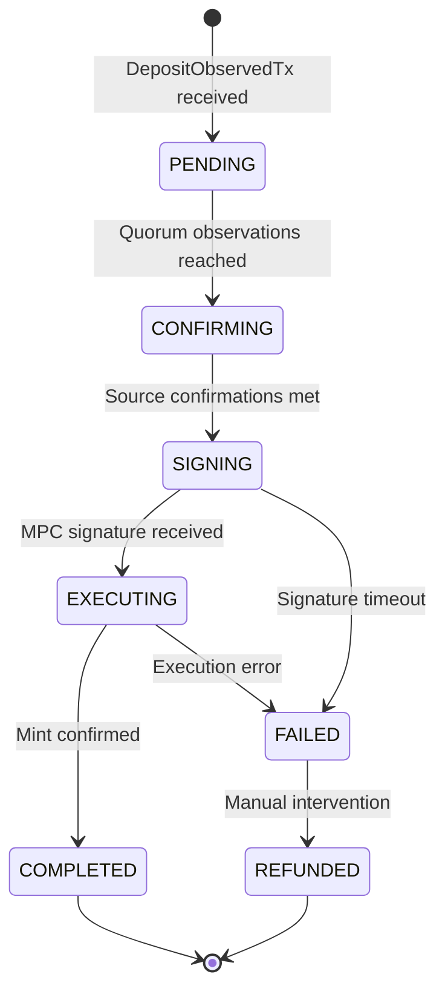
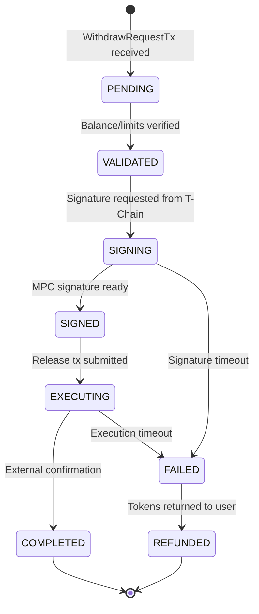
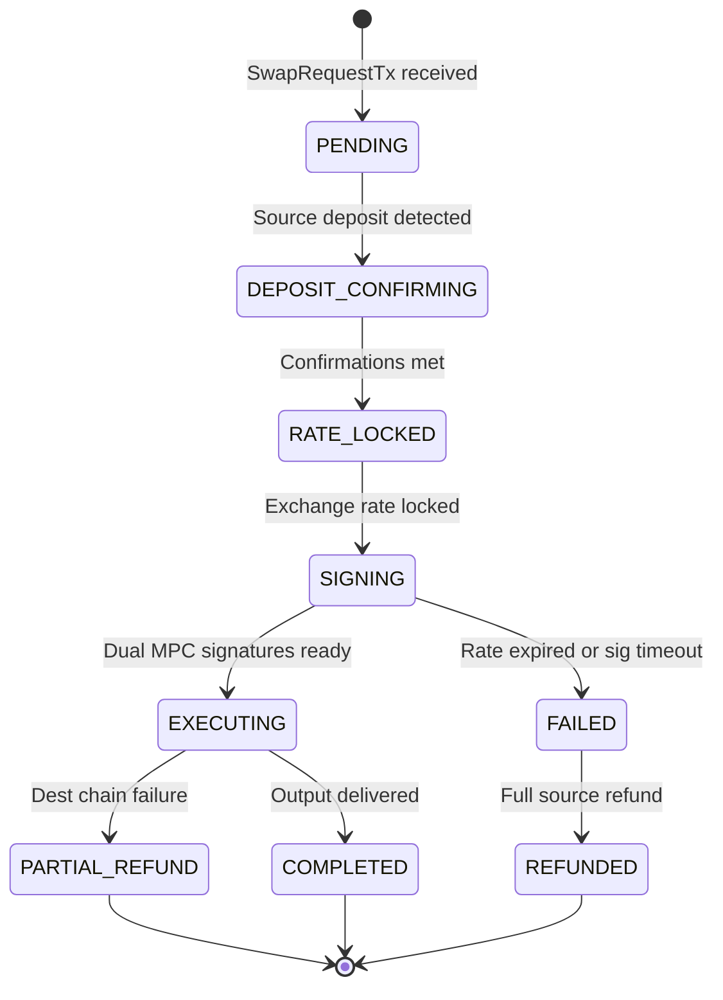

> **See also**: [LP-330 T-Chain ThresholdVM](./lp-0330-t-chain-thresholdvm-specification.md), [LP-332 Teleport Bridge Architecture](./lp-0332-teleport-bridge-architecture-unified-cross-chain-protocol.md), [LP-333 Dynamic Signer Rotation](./lp-0333-dynamic-signer-rotation-with-lss-protocol.md), [LP-334 Per-Asset Threshold Key Management](./lp-0334-per-asset-threshold-key-management.md), [LP-335 Bridge Smart Contract Integration](./lp-0335-bridge-smart-contract-integration.md), [LP-INDEX](./LP-INDEX.md)

# LP-331: B-Chain - BridgeVM Specification

## Abstract

This LP specifies the B-Chain (BridgeVM), a purpose-built virtual machine for Lux Network that handles all cross-chain bridge operations. B-Chain operates as a dedicated blockchain within the Lux primary network, coordinating with T-Chain for threshold signatures and managing bridge vaults on external chains. The BridgeVM processes deposit observations, withdrawal requests, and cross-chain swaps using Multi-Party Computation (MPC) addresses for trustless custody. This specification defines the complete architecture including the VM state machine, transaction types, external chain watchers, signature request flows, RPC APIs, fee models, and security framework. B-Chain supports Ethereum, Bitcoin, Base, Arbitrum, Optimism, Cosmos, and other external chains through a unified MPC address that works across all EVM-compatible networks.

## Activation

| Parameter          | Value                           |
|--------------------|---------------------------------|
| Flag string        | `lp331-bridgevm`                |
| Default in code    | **false** until block 0         |
| Deployment branch  | `v1.0.0-lp331`                  |
| Roll-out criteria  | Testnet validation 30 days      |
| Back-off plan      | Disable via governance vote     |

## Motivation

### Problem Statement

Current cross-chain bridge architectures suffer from several fundamental weaknesses:

1. **Centralized Custody**: Most bridges rely on multisig wallets controlled by a small committee, creating single points of failure and trust assumptions.

2. **Fragmented Security**: Different bridge implementations use varying security models, making comprehensive auditing difficult and increasing attack surface.

3. **Resource Competition**: Bridge operations compete for block space with other transactions, causing unpredictable latency during high-demand periods.

4. **Operational Complexity**: Managing bridges across multiple chains independently leads to inconsistent behavior and maintenance burden.

5. **Quantum Vulnerability**: Classical ECDSA signatures used by existing bridges are vulnerable to future quantum attacks.

### Solution

B-Chain addresses these challenges by providing:

1. **Dedicated Infrastructure**: A purpose-built blockchain optimized exclusively for bridge operations, eliminating resource competition.

2. **Unified MPC Custody**: A single MPC-derived address works across all EVM chains, simplifying vault management while maintaining decentralized control.

3. **T-Chain Coordination**: Integration with the Threshold Chain (T-Chain) for secure, distributed signature generation using CGG21/CGGMP21 protocols.

4. **Quantum-Safe Extensions**: Support for post-quantum cryptography through Ringtail lattice-based signatures during the transition period.

5. **Standardized Operations**: A single, auditable codebase for all cross-chain transfers with consistent security guarantees.

## Conformance

The key words "MUST", "MUST NOT", "REQUIRED", "SHALL", "SHALL NOT", "SHOULD", "SHOULD NOT", "RECOMMENDED", "NOT RECOMMENDED", "MAY", and "OPTIONAL" in this document are to be interpreted as described in BCP 14 [RFC 2119] [RFC 8174] when, and only when, they appear in all capitals, as shown here.

### Conformance Requirements

Implementations claiming conformance to this specification:

1. **MUST** implement all transaction types defined in Section "Transaction Types"
2. **MUST** verify MPC signatures using the CGG21/CGGMP21 protocol as specified
3. **MUST** enforce observation quorum requirements before processing deposits
4. **MUST** respect per-asset daily limits and minimum/maximum transfer amounts
5. **MUST** implement the fraud proof system for dispute resolution
6. **SHOULD** support all chain types (EVM, Bitcoin, Cosmos) defined in this specification
7. **SHOULD** implement WebSocket subscriptions for real-time updates
8. **MAY** extend the fee model with additional chain-specific parameters
9. **MUST NOT** process withdrawals without valid T-Chain MPC signatures
10. **MUST NOT** accept deposits without sufficient confirmations on source chains

### RPC Endpoint Requirements

- B-Chain RPC **MUST** be accessible on port 9630 (standard Lux RPC port)
- WebSocket subscriptions **SHOULD** be available on port 9631
- All RPC methods **MUST** return errors using standard JSON-RPC 2.0 error codes

## Specification

### Architecture Overview

```
+-------------------------------------------------------------------------+
|                         Teleport Network (5+ nodes)                      |
+-------------------------------------------------------------------------+
|  +-------------+  +-------------+  +-------------+  +-------------+     |
|  |   Node 1    |  |   Node 2    |  |   Node 3    |  |   Node 4    | ... |
|  | +---------+ |  | +---------+ |  | +---------+ |  | +---------+ |     |
|  | |B-Chain  | |  | |B-Chain  | |  | |B-Chain  | |  | |B-Chain  | |     |
|  | |BridgeVM | |  | |BridgeVM | |  | |BridgeVM | |  | |BridgeVM | |     |
|  | +---------+ |  | +---------+ |  | +---------+ |  | +---------+ |     |
|  | +---------+ |  | +---------+ |  | +---------+ |  | +---------+ |     |
|  | |T-Chain  | |  | |T-Chain  | |  | |T-Chain  | |  | |T-Chain  | |     |
|  | |Share s1 | |  | |Share s2 | |  | |Share s3 | |  | |Share s4 | |     |
|  | +---------+ |  | +---------+ |  | +---------+ |  | +---------+ |     |
|  +-------------+  +-------------+  +-------------+  +-------------+     |
+-------------------------------------------------------------------------+
                                      |
                                      | MPC Threshold Signature
                                      v
+-------------------------------------------------------------------------+
|                          External Chains                                 |
|  +----------+  +----------+  +----------+  +----------+  +----------+   |
|  |   LUX    |  |   ETH    |  |  Base    |  |Arbitrum  |  | Bitcoin  |   |
|  | C-Chain  |  | Mainnet  |  |          |  |   One    |  |          |   |
|  +----------+  +----------+  +----------+  +----------+  +----------+   |
|  |  Bridge  |  |  Bridge  |  |  Bridge  |  |  Bridge  |  |  Bridge  |   |
|  | Contract |  | Contract |  | Contract |  | Contract |  |  Vault   |   |
|  |mpcSigner:|  |mpcSigner:|  |mpcSigner:|  |mpcSigner:|  |mpcPubKey:|   |
|  |0xMPC...  |  |0xMPC...  |  |0xMPC...  |  |0xMPC...  |  |bc1p...   |   |
|  +----------+  +----------+  +----------+  +----------+  +----------+   |
|                                                                          |
|  Same MPC address works on all EVM chains (deterministic derivation)    |
+-------------------------------------------------------------------------+
```

### VM Architecture

#### Chain Parameters

```go
// BridgeVMConfig defines the B-Chain configuration
type BridgeVMConfig struct {
    ChainID         ids.ID          // B-Chain identifier
    NetworkID       uint32          // Lux network ID
    BlockGasLimit   uint64          // 8,000,000 default
    MinBaseFee      *big.Int        // 25 gwei
    TargetBlockRate time.Duration   // 2 seconds

    // MPC Configuration
    MPCThreshold    uint32          // 2/3 + 1 of validators
    MPCKeyRotation  uint64          // Blocks between key rotations

    // External Chain Configuration
    SupportedChains []ChainConfig

    // Security Parameters
    ObservationQuorum   uint32      // Required observer confirmations
    ChallengeWindow     uint64      // Blocks for fraud proofs
    MaxPendingRequests  uint64      // Rate limiting
}

// ChainConfig defines an external chain connection
type ChainConfig struct {
    ChainID         uint64
    ChainType       ChainType       // EVM, Bitcoin, Cosmos
    Name            string
    RPCURL          string
    BridgeContract  common.Address  // For EVM chains
    VaultAddress    string          // For non-EVM chains
    Confirmations   uint64          // Required confirmations
    Enabled         bool
}

type ChainType uint8

const (
    ChainTypeEVM     ChainType = 0
    ChainTypeBitcoin ChainType = 1
    ChainTypeCosmos  ChainType = 2
    ChainTypeSolana  ChainType = 3
)
```

#### Block Structure

```go
// BridgeBlock represents a B-Chain block
type BridgeBlock struct {
    Header       BridgeBlockHeader
    Transactions []BridgeTx

    // Cached values
    hash ids.ID
}

type BridgeBlockHeader struct {
    ParentHash      ids.ID
    Height          uint64
    Timestamp       uint64
    StateRoot       ids.ID
    TxRoot          ids.ID
    ReceiptsRoot    ids.ID

    // Bridge-specific fields
    ObservationRoot ids.ID          // Merkle root of observed deposits
    SignatureRoot   ids.ID          // Merkle root of completed signatures

    // Consensus
    ProposerID      ids.NodeID
    ProposerSig     []byte
}
```

#### State Model

```go
// BridgeState represents the complete B-Chain state
type BridgeState struct {
    // Asset tracking
    AssetRegistry    map[AssetID]*AssetInfo
    TotalValueLocked map[AssetID]*big.Int

    // Bridge operations
    PendingDeposits   map[DepositID]*DepositRecord
    PendingWithdrawals map[WithdrawID]*WithdrawRecord
    PendingSwaps      map[SwapID]*SwapRecord

    // Completed operations (for proof generation)
    CompletedOps     map[ids.ID]*CompletionProof

    // Chain state
    ChainHeights     map[uint64]uint64    // External chain heights
    ChainStates      map[uint64]*ChainState

    // Relayer tracking
    RelayerRegistry  map[common.Address]*RelayerInfo
    RelayerRewards   map[common.Address]*big.Int

    // Security
    FraudProofs      []FraudProofRecord
    PausedAssets     map[AssetID]bool

    // MPC key management
    CurrentMPCKey    *MPCPublicKey
    PendingKeyRotation *KeyRotationRecord
}

type AssetInfo struct {
    AssetID         AssetID
    OriginChainID   uint64
    OriginAddress   []byte
    Symbol          string
    Decimals        uint8
    TotalBridged    *big.Int
    MinTransfer     *big.Int
    MaxTransfer     *big.Int
    DailyLimit      *big.Int
    DailyUsed       *big.Int
    LastResetBlock  uint64
    Paused          bool
}

type DepositRecord struct {
    DepositID       DepositID
    SourceChainID   uint64
    SourceTxHash    []byte
    SourceBlock     uint64
    AssetID         AssetID
    Amount          *big.Int
    Sender          []byte
    Recipient       common.Address
    Status          BridgeStatus
    Confirmations   uint64
    ObservedAt      uint64
    CompletedAt     uint64
}

type WithdrawRecord struct {
    WithdrawID      WithdrawID
    DestChainID     uint64
    AssetID         AssetID
    Amount          *big.Int
    Sender          common.Address
    Recipient       []byte
    Fee             *big.Int
    Status          BridgeStatus
    RequestedAt     uint64
    SignedAt        uint64
    ExecutedAt      uint64
    DestTxHash      []byte
}

type SwapRecord struct {
    SwapID          SwapID
    SourceChainID   uint64
    DestChainID     uint64
    SourceAsset     AssetID
    DestAsset       AssetID
    InputAmount     *big.Int
    OutputAmount    *big.Int
    Sender          []byte
    Recipient       []byte
    ExchangeRate    *big.Int
    Slippage        uint16          // Basis points
    Status          BridgeStatus
    RequestedAt     uint64
    CompletedAt     uint64
}

type BridgeStatus uint8

const (
    StatusPending    BridgeStatus = 0
    StatusConfirming BridgeStatus = 1
    StatusSigning    BridgeStatus = 2
    StatusExecuting  BridgeStatus = 3
    StatusCompleted  BridgeStatus = 4
    StatusFailed     BridgeStatus = 5
    StatusRefunded   BridgeStatus = 6
)
```

### Transaction Types

The BridgeVM processes eight core transaction types:

#### 1. DepositObservedTx

Submitted by relayers when a deposit is detected on an external chain.

```go
const TxTypeDepositObserved = 0xB1

type DepositObservedTx struct {
    BaseTx

    // Source chain information
    SourceChainID   uint64
    SourceTxHash    [32]byte
    SourceBlock     uint64
    SourceLogIndex  uint16

    // Deposit details
    AssetID         AssetID
    Amount          *big.Int
    Sender          []byte          // Variable length for non-EVM
    Recipient       common.Address  // Lux destination

    // Proof of deposit
    DepositProof    DepositProof

    // Relayer signature
    RelayerAddress  common.Address
    RelayerSig      []byte
}

type DepositProof struct {
    // For EVM chains: Merkle-Patricia proof
    BlockHeader     []byte
    ReceiptProof    [][]byte
    LogIndex        uint16

    // For Bitcoin: SPV proof
    MerkleProof     [][]byte
    TxIndex         uint32

    // For Cosmos: IBC proof
    IBCProof        []byte
}

// Validation rules
func (tx *DepositObservedTx) Verify(state *BridgeState) error {
    // 1. Verify source chain is supported
    chain := state.ChainStates[tx.SourceChainID]
    if chain == nil {
        return ErrUnsupportedChain
    }

    // 2. Verify deposit not already observed
    depositID := ComputeDepositID(tx.SourceChainID, tx.SourceTxHash, tx.SourceLogIndex)
    if state.PendingDeposits[depositID] != nil {
        return ErrDuplicateDeposit
    }

    // 3. Verify proof against known chain state
    if err := VerifyDepositProof(chain, tx.DepositProof, tx); err != nil {
        return err
    }

    // 4. Verify asset is registered and not paused
    asset := state.AssetRegistry[tx.AssetID]
    if asset == nil || asset.Paused {
        return ErrAssetNotAvailable
    }

    // 5. Verify amount within limits
    if tx.Amount.Cmp(asset.MinTransfer) < 0 {
        return ErrBelowMinimum
    }
    if tx.Amount.Cmp(asset.MaxTransfer) > 0 {
        return ErrAboveMaximum
    }

    // 6. Verify relayer is registered
    relayer := state.RelayerRegistry[tx.RelayerAddress]
    if relayer == nil || !relayer.Active {
        return ErrUnregisteredRelayer
    }

    // 7. Verify relayer signature
    hash := tx.SigningHash()
    if !VerifySignature(tx.RelayerAddress, hash, tx.RelayerSig) {
        return ErrInvalidSignature
    }

    return nil
}
```

#### 2. WithdrawRequestTx

Submitted by users to request a withdrawal to an external chain.

```go
const TxTypeWithdrawRequest = 0xB2

type WithdrawRequestTx struct {
    BaseTx

    // Destination
    DestChainID     uint64
    Recipient       []byte          // Destination address (variable length)

    // Asset and amount
    AssetID         AssetID
    Amount          *big.Int

    // Fee payment
    MaxFee          *big.Int        // Maximum acceptable fee

    // Request metadata
    Deadline        uint64          // Block deadline for execution
    Nonce           uint64          // User nonce for replay protection

    // Authorization
    Sender          common.Address
    Signature       []byte
}

func (tx *WithdrawRequestTx) Verify(state *BridgeState) error {
    // 1. Verify destination chain supported
    if state.ChainStates[tx.DestChainID] == nil {
        return ErrUnsupportedChain
    }

    // 2. Verify asset available
    asset := state.AssetRegistry[tx.AssetID]
    if asset == nil || asset.Paused {
        return ErrAssetNotAvailable
    }

    // 3. Verify user has sufficient balance
    balance := state.GetUserBalance(tx.Sender, tx.AssetID)
    totalNeeded := new(big.Int).Add(tx.Amount, tx.MaxFee)
    if balance.Cmp(totalNeeded) < 0 {
        return ErrInsufficientBalance
    }

    // 4. Verify amount within limits
    if tx.Amount.Cmp(asset.MinTransfer) < 0 {
        return ErrBelowMinimum
    }

    // 5. Verify daily limit not exceeded
    dailyRemaining := new(big.Int).Sub(asset.DailyLimit, asset.DailyUsed)
    if tx.Amount.Cmp(dailyRemaining) > 0 {
        return ErrDailyLimitExceeded
    }

    // 6. Verify deadline is reasonable
    if tx.Deadline < state.CurrentBlock+10 {
        return ErrDeadlineTooSoon
    }
    if tx.Deadline > state.CurrentBlock+43200 { // ~24 hours
        return ErrDeadlineTooFar
    }

    // 7. Verify nonce
    expectedNonce := state.GetUserNonce(tx.Sender)
    if tx.Nonce != expectedNonce {
        return ErrInvalidNonce
    }

    // 8. Verify signature
    hash := tx.SigningHash()
    if !VerifySignature(tx.Sender, hash, tx.Signature) {
        return ErrInvalidSignature
    }

    return nil
}
```

#### 3. WithdrawExecuteTx

Submitted after T-Chain provides the MPC signature to execute a withdrawal.

```go
const TxTypeWithdrawExecute = 0xB3

type WithdrawExecuteTx struct {
    BaseTx

    // Reference to pending withdrawal
    WithdrawID      WithdrawID

    // MPC signature for external chain
    MPCSignature    MPCSignature

    // Execution details
    GasPrice        *big.Int        // For EVM chains
    GasLimit        uint64

    // Relayer execution
    ExecutorAddress common.Address
    ExecutorSig     []byte
}

type MPCSignature struct {
    // CGG21 ECDSA signature components
    R               *big.Int
    S               *big.Int
    V               uint8

    // Signer bitmap
    SignerBitmap    []byte

    // Optional: Ringtail quantum-safe signature
    RingtailSig     []byte

    // T-Chain proof
    TChainBlockHash ids.ID
    TChainProof     []byte
}

func (tx *WithdrawExecuteTx) Verify(state *BridgeState) error {
    // 1. Verify withdrawal exists and is in signing state
    withdraw := state.PendingWithdrawals[tx.WithdrawID]
    if withdraw == nil {
        return ErrWithdrawalNotFound
    }
    if withdraw.Status != StatusSigning {
        return ErrInvalidWithdrawalState
    }

    // 2. Verify deadline not passed
    if state.CurrentBlock > withdraw.RequestedAt+43200 {
        return ErrWithdrawalExpired
    }

    // 3. Verify MPC signature
    message := ComputeWithdrawalMessage(withdraw)
    if err := VerifyMPCSignature(state.CurrentMPCKey, message, &tx.MPCSignature); err != nil {
        return err
    }

    // 4. Verify signer threshold met
    signerCount := CountBits(tx.MPCSignature.SignerBitmap)
    if signerCount < state.MPCThreshold() {
        return ErrInsufficientSigners
    }

    // 5. Verify T-Chain proof
    if err := VerifyTChainProof(tx.MPCSignature.TChainBlockHash, tx.MPCSignature.TChainProof); err != nil {
        return err
    }

    // 6. Verify executor is authorized relayer
    executor := state.RelayerRegistry[tx.ExecutorAddress]
    if executor == nil || !executor.Active {
        return ErrUnauthorizedExecutor
    }

    return nil
}
```

#### 4. SwapRequestTx

Request a cross-chain swap (deposit on source, receive different asset on destination).

```go
const TxTypeSwapRequest = 0xB4

type SwapRequestTx struct {
    BaseTx

    // Source details
    SourceChainID   uint64
    SourceAsset     AssetID
    InputAmount     *big.Int

    // Destination details
    DestChainID     uint64
    DestAsset       AssetID
    MinOutputAmount *big.Int        // Slippage protection

    // Parties
    Sender          []byte
    Recipient       []byte

    // Swap parameters
    MaxSlippage     uint16          // Basis points (100 = 1%)
    Deadline        uint64

    // Fee
    MaxFee          *big.Int

    // Proof of source deposit (if already deposited)
    DepositProof    *DepositProof   // Optional

    Signature       []byte
}
```

#### 5. SwapExecuteTx

Execute a cross-chain swap after signature generation.

```go
const TxTypeSwapExecute = 0xB5

type SwapExecuteTx struct {
    BaseTx

    SwapID          SwapID

    // Final amounts (may differ from request due to rate changes)
    FinalOutputAmount *big.Int
    ExchangeRate    *big.Int

    // MPC signatures for both chains if needed
    SourceSignature *MPCSignature   // For refund if swap fails
    DestSignature   *MPCSignature   // For output delivery

    ExecutorAddress common.Address
    ExecutorSig     []byte
}
```

#### 6. ChainRegistrationTx

Register a new external chain for bridging.

```go
const TxTypeChainRegistration = 0xB6

type ChainRegistrationTx struct {
    BaseTx

    // Chain identification
    ChainID         uint64
    ChainType       ChainType
    Name            string

    // Connection parameters
    RPCURL          string
    WSUrl           string

    // Bridge contract/vault
    BridgeAddress   []byte

    // Security parameters
    Confirmations   uint64
    BlockTime       uint64          // Average block time in seconds

    // Governance approval
    GovernanceProof GovernanceProof
}

type GovernanceProof struct {
    ProposalID      ids.ID
    VoteRoot        ids.ID
    Signatures      []GovernorSignature
}

func (tx *ChainRegistrationTx) Verify(state *BridgeState) error {
    // 1. Verify chain not already registered
    if state.ChainStates[tx.ChainID] != nil {
        return ErrChainAlreadyRegistered
    }

    // 2. Verify governance approval
    if err := VerifyGovernanceProof(&tx.GovernanceProof); err != nil {
        return err
    }

    // 3. Verify minimum confirmations for chain type
    minConf := MinConfirmationsForChainType(tx.ChainType)
    if tx.Confirmations < minConf {
        return ErrInsufficientConfirmations
    }

    return nil
}
```

#### 7. AssetRegistrationTx

Register a new bridgeable asset.

```go
const TxTypeAssetRegistration = 0xB7

type AssetRegistrationTx struct {
    BaseTx

    // Asset identification
    OriginChainID   uint64
    OriginAddress   []byte

    // Metadata
    Name            string
    Symbol          string
    Decimals        uint8

    // Bridge parameters
    MinTransfer     *big.Int
    MaxTransfer     *big.Int
    DailyLimit      *big.Int
    BaseFee         *big.Int
    PercentageFee   uint16          // Basis points

    // Wrapped token deployment (for Lux-side)
    WrappedAddress  common.Address  // Pre-deployed or to be deployed

    // Governance approval
    GovernanceProof GovernanceProof
}
```

#### 8. RelayerRewardTx

Distribute rewards to relayers for successful operations.

```go
const TxTypeRelayerReward = 0xB8

type RelayerRewardTx struct {
    BaseTx

    // Reward distribution
    Epoch           uint64
    Recipients      []common.Address
    Amounts         []*big.Int

    // Proof of work done
    OperationHashes []ids.ID

    // Signed by reward distributor
    DistributorSig  []byte
}
```

### Bridge State Machine

The B-Chain manages bridge operations through comprehensive state machines for deposits and withdrawals.

#### Deposit State Machine

```
                              External Chain                           B-Chain
                     +-----------------------------+      +--------------------------------+
                     |                             |      |                                |
                     |     User deposits to        |      |                                |
                     |     bridge vault/contract   |      |                                |
                     |              |              |      |                                |
                     |              v              |      |                                |
                     |     +--------------+        |      |                                |
                     |     |   INITIATED  |        |      |                                |
                     |     +------+-------+        |      |                                |
                     |            |               |      |                                |
                     |            | Transaction   |      |                                |
                     |            | confirmed     |      |                                |
                     |            |               |      |                                |
                     +------------+---------------+      |                                |
                                  |                      |                                |
                                  | Relayers observe     |                                |
                                  v                      |                                |
                     +------------+---------------+      |      +----------------+        |
                     |    OBSERVED (by relayer)   |----->|----->|    PENDING     |        |
                     +----------------------------+      |      +-------+--------+        |
                                                         |              |                 |
                                                         |    Quorum of observations      |
                                                         |              |                 |
                                                         |      +-------v--------+        |
                                                         |      |  CONFIRMING    |        |
                                                         |      +-------+--------+        |
                                                         |              |                 |
                                                         |    Required confirmations       |
                                                         |    reached on source chain      |
                                                         |              |                 |
                                                         |      +-------v--------+        |
                                                         |      |    SIGNING     |        |
                                                         |      +-------+--------+        |
                                                         |              |                 |
                                                         |    T-Chain provides MPC        |
                                                         |    signature for mint          |
                                                         |              |                 |
                                                         |      +-------v--------+        |
                                                         |      |   EXECUTING    |        |
                                                         |      +-------+--------+        |
                                                         |              |                 |
                                                         |    Wrapped tokens minted       |
                                                         |    on destination chain        |
                                                         |              |                 |
                                                         |      +-------v--------+        |
                                                         |      |   COMPLETED    |        |
                                                         |      +----------------+        |
                                                         |                                |
                                                         +--------------------------------+
```

#### Withdrawal State Machine

```
                              Lux Network                              External Chain
                     +--------------------------------+      +---------------------------+
                     |                                |      |                           |
                     |     User requests withdrawal   |      |                           |
                     |     (burns wrapped tokens)     |      |                           |
                     |              |                 |      |                           |
                     |              v                 |      |                           |
                     |      +----------------+        |      |                           |
                     |      |    PENDING     |        |      |                           |
                     |      +-------+--------+        |      |                           |
                     |              |                 |      |                           |
                     |    Validate burn proof         |      |                           |
                     |    Check balance/limits        |      |                           |
                     |              |                 |      |                           |
                     |      +-------v--------+        |      |                           |
                     |      |   VALIDATED    |        |      |                           |
                     |      +-------+--------+        |      |                           |
                     |              |                 |      |                           |
                     |    Request signature from      |      |                           |
                     |    T-Chain (via Warp msg)      |      |                           |
                     |              |                 |      |                           |
                     |      +-------v--------+        |      |                           |
                     |      |    SIGNING     |        |      |                           |
                     |      +-------+--------+        |      |                           |
                     |              |                 |      |                           |
                     |    T-Chain threshold sign      |      |                           |
                     |    completes (CGG21/LSS)       |      |                           |
                     |              |                 |      |                           |
                     |      +-------v--------+        |      |                           |
                     |      |    SIGNED      |------->|----->|   EXECUTING             |
                     |      +----------------+        |      |       |                   |
                     |                                |      |       v                   |
                     |                                |      |   Submit MPC-signed      |
                     |                                |      |   release tx to vault    |
                     |                                |      |       |                   |
                     |                                |      |       v                   |
                     |                                |      |   +----------------+      |
                     |      +----------------+        |      |   |   COMPLETED    |      |
                     |      |   COMPLETED    |<-------|<-----|   +----------------+      |
                     |      +----------------+        |      |                           |
                     |                                |      |                           |
                     +--------------------------------+      +---------------------------+
```

#### Consolidated State Diagram

```
                    +-----------+
                    |  PENDING  |
                    +-----+-----+
                          |
            Observations received (quorum)
                          |
                    +-----v-----+
                    |CONFIRMING |
                    +-----+-----+
                          |
            External confirmations reached
                          |
                    +-----v-----+
                    |  SIGNING  |<-----------------+
                    +-----+-----+                  |
                          |                        |
            T-Chain signature ready        Signature timeout
                          |                        |
                    +-----v-----+            +-----+-----+
                    | EXECUTING |            |  FAILED   |
                    +-----+-----+            +-----+-----+
                          |                        ^
            External tx confirmed                  |
                          |         Execution failure / Timeout
                    +-----v-----+            +-----+-----+
                    | COMPLETED |            | REFUNDED  |
                    +-----------+            +-----------+
```

#### Mermaid State Diagrams

**Deposit Flow State Machine**:



**Withdrawal Flow State Machine**:



**Cross-Chain Swap State Machine**:



#### State Transition Logic

```go
type BridgeStateMachine struct {
    state *BridgeState
}

func (sm *BridgeStateMachine) ProcessBlock(block *BridgeBlock) error {
    // 1. Process pending deposits
    for _, deposit := range sm.state.PendingDeposits {
        sm.processDeposit(deposit)
    }

    // 2. Process pending withdrawals
    for _, withdraw := range sm.state.PendingWithdrawals {
        sm.processWithdrawal(withdraw)
    }

    // 3. Process pending swaps
    for _, swap := range sm.state.PendingSwaps {
        sm.processSwap(swap)
    }

    // 4. Update chain heights
    sm.updateChainHeights()

    // 5. Process daily limit resets
    sm.resetDailyLimits()

    // 6. Distribute relayer rewards
    sm.distributeRewards()

    return nil
}

func (sm *BridgeStateMachine) processDeposit(deposit *DepositRecord) {
    switch deposit.Status {
    case StatusPending:
        // Check if we have quorum of observations
        observations := sm.countObservations(deposit.DepositID)
        if observations >= sm.state.ObservationQuorum {
            deposit.Status = StatusConfirming
        }

    case StatusConfirming:
        // Check if external confirmations reached
        chainState := sm.state.ChainStates[deposit.SourceChainID]
        currentHeight := chainState.Height
        requiredConfs := chainState.Confirmations

        if currentHeight-deposit.SourceBlock >= requiredConfs {
            deposit.Status = StatusSigning
            sm.requestSignature(deposit)
        }

    case StatusSigning:
        // Signature handled by T-Chain, transition happens via WithdrawExecuteTx
        // Check for timeout
        if sm.state.CurrentBlock-deposit.ObservedAt > SignatureTimeout {
            deposit.Status = StatusFailed
        }

    case StatusExecuting:
        // Check for execution completion
        if sm.verifyExternalExecution(deposit) {
            deposit.Status = StatusCompleted
            deposit.CompletedAt = sm.state.CurrentBlock
        }
    }
}
```

### External Chain Watchers

#### Watcher Architecture

```go
// ChainWatcher observes external chains for bridge events
type ChainWatcher struct {
    config      WatcherConfig
    chainClient ChainClient
    state       *WatcherState

    // Channels for communication
    deposits    chan *DepositEvent
    completions chan *CompletionEvent
    errors      chan error
}

type WatcherConfig struct {
    ChainID         uint64
    ChainType       ChainType
    RPCEndpoints    []string        // Multiple for redundancy
    WSEndpoints     []string
    BridgeContract  []byte
    PollInterval    time.Duration
    BatchSize       uint64
}

type WatcherState struct {
    LastProcessedBlock uint64
    PendingDeposits    map[DepositID]*DepositEvent
    LastHeartbeat      time.Time
}
```

#### EVM Chain Watcher

```go
import (
    "context"
    "math/big"

    "github.com/luxfi/geth/accounts/abi"
    "github.com/luxfi/geth/common"
    "github.com/luxfi/geth/core/types"
    "github.com/luxfi/geth/crypto"
    "github.com/luxfi/geth/ethclient"
    "github.com/luxfi/geth/interfaces"
)

// EVMWatcher watches EVM-compatible chains
type EVMWatcher struct {
    ChainWatcher
    clients     []*ethclient.Client
    bridgeABI   abi.ABI
}

func (w *EVMWatcher) Watch(ctx context.Context) error {
    // Subscribe to bridge events
    bridgeContract := common.BytesToAddress(w.config.BridgeContract)

    // Event signatures
    depositSig := crypto.Keccak256Hash([]byte("Deposit(address,address,uint256,bytes32)"))

    query := interfaces.FilterQuery{
        Addresses: []common.Address{bridgeContract},
        Topics:    [][]common.Hash{{depositSig}},
    }

    logs := make(chan types.Log)
    sub, err := w.clients[0].SubscribeFilterLogs(ctx, query, logs)
    if err != nil {
        return err
    }

    for {
        select {
        case <-ctx.Done():
            return ctx.Err()

        case err := <-sub.Err():
            // Reconnect logic
            w.reconnect(ctx)

        case log := <-logs:
            deposit, err := w.parseDepositLog(log)
            if err != nil {
                w.errors <- err
                continue
            }
            w.deposits <- deposit
        }
    }
}

func (w *EVMWatcher) parseDepositLog(log types.Log) (*DepositEvent, error) {
    // Parse ABI-encoded log data
    event := struct {
        Sender    common.Address
        Token     common.Address
        Amount    *big.Int
        Recipient [32]byte
    }{}

    if err := w.bridgeABI.UnpackIntoInterface(&event, "Deposit", log.Data); err != nil {
        return nil, err
    }

    return &DepositEvent{
        SourceChainID: w.config.ChainID,
        SourceTxHash:  log.TxHash.Bytes(),
        SourceBlock:   log.BlockNumber,
        LogIndex:      uint16(log.Index),
        Token:         event.Token.Bytes(),
        Amount:        event.Amount,
        Sender:        event.Sender.Bytes(),
        Recipient:     event.Recipient[:],
    }, nil
}
```

#### Bitcoin Watcher

```go
// BTCWatcher watches Bitcoin for bridge deposits
type BTCWatcher struct {
    ChainWatcher
    btcClient   *rpcclient.Client
    vaultPubKey *btcec.PublicKey
}

func (w *BTCWatcher) Watch(ctx context.Context) error {
    ticker := time.NewTicker(w.config.PollInterval)
    defer ticker.Stop()

    for {
        select {
        case <-ctx.Done():
            return ctx.Err()

        case <-ticker.C:
            deposits, err := w.scanForDeposits()
            if err != nil {
                w.errors <- err
                continue
            }

            for _, deposit := range deposits {
                w.deposits <- deposit
            }
        }
    }
}

func (w *BTCWatcher) scanForDeposits() ([]*DepositEvent, error) {
    // Get vault address (P2TR for MPC)
    vaultAddr := w.computeVaultAddress()

    // Get unspent outputs to vault
    utxos, err := w.btcClient.ListUnspentMinMaxAddresses(
        1,      // minconf
        9999999, // maxconf
        []btcutil.Address{vaultAddr},
    )
    if err != nil {
        return nil, err
    }

    var deposits []*DepositEvent
    for _, utxo := range utxos {
        // Check if already processed
        if w.isProcessed(utxo.TxID) {
            continue
        }

        // Parse OP_RETURN for recipient
        tx, err := w.btcClient.GetRawTransaction(&utxo.TxID)
        if err != nil {
            continue
        }

        recipient := w.extractRecipient(tx)
        if recipient == nil {
            continue
        }

        deposits = append(deposits, &DepositEvent{
            SourceChainID: 0, // Bitcoin
            SourceTxHash:  utxo.TxID[:],
            SourceBlock:   w.getBlockHeight(utxo.TxID),
            Amount:        big.NewInt(int64(utxo.Amount * 1e8)),
            Recipient:     recipient,
        })
    }

    return deposits, nil
}
```

#### Cosmos IBC Watcher

```go
import (
    "context"
    "encoding/json"
    "time"

    "github.com/luxfi/crypto"
    "github.com/luxfi/ids"
)

// CosmosWatcher watches Cosmos IBC chains for bridge deposits
type CosmosWatcher struct {
    ChainWatcher
    rpcEndpoint    string
    wsEndpoint     string
    bridgeModule   string  // IBC module address
    channelID      string  // IBC channel for Lux bridge
}

// CosmosDepositEvent represents a deposit from Cosmos chain
type CosmosDepositEvent struct {
    SourceChainID  string   // Cosmos chain-id (e.g., "cosmoshub-4")
    TxHash         []byte
    Height         uint64
    Sender         string   // Bech32 address
    Amount         *big.Int
    Denom          string   // IBC denom
    Recipient      []byte   // Lux recipient address
    Sequence       uint64   // IBC packet sequence
    TimeoutHeight  uint64
}

// IBCPacketData represents ICS-20 fungible token transfer data
type IBCPacketData struct {
    Denom    string `json:"denom"`
    Amount   string `json:"amount"`
    Sender   string `json:"sender"`
    Receiver string `json:"receiver"`
    Memo     string `json:"memo,omitempty"`
}

func (w *CosmosWatcher) Watch(ctx context.Context) error {
    // Connect to Cosmos websocket
    conn, err := w.connectWebsocket(ctx)
    if err != nil {
        return err
    }
    defer conn.Close()

    // Subscribe to IBC transfer events
    subscribeQuery := `tm.event='Tx' AND ibc_transfer.sender EXISTS`
    if err := w.subscribe(conn, subscribeQuery); err != nil {
        return err
    }

    for {
        select {
        case <-ctx.Done():
            return ctx.Err()

        default:
            msg, err := w.readMessage(conn)
            if err != nil {
                w.errors <- err
                continue
            }

            deposit, err := w.parseIBCTransfer(msg)
            if err != nil {
                continue // Not a relevant transfer
            }

            // Verify transfer is to bridge channel
            if deposit.ChannelID != w.channelID {
                continue
            }

            w.deposits <- deposit
        }
    }
}

func (w *CosmosWatcher) parseIBCTransfer(msg []byte) (*CosmosDepositEvent, error) {
    // Parse Tendermint event
    var event struct {
        Result struct {
            Events []struct {
                Type       string `json:"type"`
                Attributes []struct {
                    Key   string `json:"key"`
                    Value string `json:"value"`
                } `json:"attributes"`
            } `json:"events"`
            Data struct {
                Value struct {
                    TxResult struct {
                        Height string `json:"height"`
                        TxHash string `json:"txhash"`
                    } `json:"TxResult"`
                } `json:"value"`
            } `json:"data"`
        } `json:"result"`
    }

    if err := json.Unmarshal(msg, &event); err != nil {
        return nil, err
    }

    // Extract IBC transfer attributes
    var sender, receiver, amount, denom string
    for _, e := range event.Result.Events {
        if e.Type == "ibc_transfer" {
            for _, attr := range e.Attributes {
                switch attr.Key {
                case "sender":
                    sender = attr.Value
                case "receiver":
                    receiver = attr.Value
                case "amount":
                    amount = attr.Value
                case "denom":
                    denom = attr.Value
                }
            }
        }
    }

    // Parse recipient as Lux address from memo or receiver field
    luxRecipient, err := w.parseRecipient(receiver)
    if err != nil {
        return nil, err
    }

    amountBig, _ := new(big.Int).SetString(amount, 10)

    return &CosmosDepositEvent{
        SourceChainID: w.config.Name,
        TxHash:        []byte(event.Result.Data.Value.TxResult.TxHash),
        Sender:        sender,
        Amount:        amountBig,
        Denom:         denom,
        Recipient:     luxRecipient,
    }, nil
}

// VerifyIBCProof verifies an IBC packet commitment proof
func (w *CosmosWatcher) VerifyIBCProof(
    channelID string,
    sequence uint64,
    proof []byte,
    proofHeight uint64,
) error {
    // Query light client state
    clientState, err := w.getClientState()
    if err != nil {
        return err
    }

    // Verify Merkle proof against commitment root
    commitmentPath := w.buildCommitmentPath(channelID, sequence)
    return w.verifyMerkleProof(
        clientState.Root,
        commitmentPath,
        proof,
    )
}
```

### Signature Request Flow to T-Chain

#### Request Protocol

```go
// SignatureRequest represents a request to T-Chain
type SignatureRequest struct {
    RequestID       ids.ID
    RequestType     SignatureRequestType
    Message         []byte          // Message to sign
    ChainID         uint64          // Target external chain
    Deadline        uint64

    // Operation reference
    OperationID     ids.ID          // DepositID, WithdrawID, or SwapID
    OperationType   OperationType
}

type SignatureRequestType uint8

const (
    SigTypeECDSA    SignatureRequestType = 0  // CGG21
    SigTypeSchnorr  SignatureRequestType = 1  // MuSig2 for Bitcoin
    SigTypeEd25519  SignatureRequestType = 2  // FROST for Cosmos
    SigTypeRingtail SignatureRequestType = 3  // Quantum-safe
)

// TChainClient handles communication with T-Chain
type TChainClient struct {
    endpoint    string
    keyShareID  ids.ID
    signer      crypto.Signer
}

func (c *TChainClient) RequestSignature(req *SignatureRequest) (*SignatureResponse, error) {
    // 1. Create signature request transaction for T-Chain
    txPayload := &TChainSignRequest{
        RequestID:   req.RequestID,
        Message:     req.Message,
        SigType:     req.RequestType,
        Deadline:    req.Deadline,
        OperationID: req.OperationID,
    }

    // 2. Submit to T-Chain
    txID, err := c.submitTransaction(txPayload)
    if err != nil {
        return nil, err
    }

    // 3. Wait for signature completion
    return c.waitForSignature(txID, req.Deadline)
}

// Signature flow through Warp messaging
func (c *TChainClient) waitForSignature(txID ids.ID, deadline uint64) (*SignatureResponse, error) {
    ticker := time.NewTicker(500 * time.Millisecond)
    defer ticker.Stop()

    for {
        select {
        case <-ticker.C:
            // Check T-Chain for signature
            resp, err := c.getSignatureStatus(txID)
            if err != nil {
                continue
            }

            if resp.Status == SignatureStatusCompleted {
                return resp, nil
            }

            if resp.Status == SignatureStatusFailed {
                return nil, ErrSignatureFailed
            }

            // Check deadline
            if c.getCurrentBlock() > deadline {
                return nil, ErrSignatureTimeout
            }
        }
    }
}
```

#### Warp Message Integration

```go
// WarpBridgeMessage for cross-chain signature coordination
type WarpBridgeMessage struct {
    // Standard Warp header
    SourceChainID   ids.ID
    DestChainID     ids.ID
    Nonce           uint64

    // Bridge-specific payload
    MessageType     WarpMessageType
    Payload         []byte
}

type WarpMessageType uint8

const (
    WarpMsgSignatureRequest  WarpMessageType = 0x01
    WarpMsgSignatureResponse WarpMessageType = 0x02
    WarpMsgDepositConfirm    WarpMessageType = 0x03
    WarpMsgWithdrawConfirm   WarpMessageType = 0x04
)

func (b *BridgeVM) SendWarpMessage(msg *WarpBridgeMessage) error {
    // Encode message
    payload, err := msg.Encode()
    if err != nil {
        return err
    }

    // Create Warp message
    warpMsg := &warp.Message{
        SourceChainID: b.chainID,
        Payload:       payload,
    }

    // Sign with BLS key
    sig, err := b.blsSigner.Sign(warpMsg.Bytes())
    if err != nil {
        return err
    }

    warpMsg.Signature = sig

    // Submit to P-Chain for aggregation
    return b.warpClient.SendMessage(warpMsg)
}
```

### Supported Chains Configuration

```go
// DefaultChainConfigs for B-Chain
var DefaultChainConfigs = []ChainConfig{
    // Lux C-Chain (native integration)
    {
        ChainID:        96369,
        ChainType:      ChainTypeEVM,
        Name:           "Lux C-Chain",
        BridgeContract: common.HexToAddress("0x..."),
        Confirmations:  1,
        Enabled:        true,
    },
    // Ethereum Mainnet
    {
        ChainID:        1,
        ChainType:      ChainTypeEVM,
        Name:           "Ethereum",
        BridgeContract: common.HexToAddress("0x..."),
        Confirmations:  12,
        Enabled:        true,
    },
    // Base
    {
        ChainID:        8453,
        ChainType:      ChainTypeEVM,
        Name:           "Base",
        BridgeContract: common.HexToAddress("0x..."),
        Confirmations:  6,
        Enabled:        true,
    },
    // Arbitrum One
    {
        ChainID:        42161,
        ChainType:      ChainTypeEVM,
        Name:           "Arbitrum One",
        BridgeContract: common.HexToAddress("0x..."),
        Confirmations:  6,
        Enabled:        true,
    },
    // Optimism
    {
        ChainID:        10,
        ChainType:      ChainTypeEVM,
        Name:           "Optimism",
        BridgeContract: common.HexToAddress("0x..."),
        Confirmations:  6,
        Enabled:        true,
    },
    // Bitcoin
    {
        ChainID:        0,
        ChainType:      ChainTypeBitcoin,
        Name:           "Bitcoin",
        VaultAddress:   "bc1p...",
        Confirmations:  6,
        Enabled:        true,
    },
    // Cosmos Hub
    {
        ChainID:        118,
        ChainType:      ChainTypeCosmos,
        Name:           "Cosmos Hub",
        BridgeContract: []byte("lux1..."),
        Confirmations:  6,
        Enabled:        true,
    },
}
```

### Asset Registry Integration

B-Chain integrates with the Asset Registry (LP-17):

```go
// AssetRegistryClient for querying registered assets
type AssetRegistryClient struct {
    registry *AssetRegistry
}

func (c *AssetRegistryClient) GetAsset(assetID AssetID) (*AssetInfo, error) {
    return c.registry.Get(assetID)
}

func (c *AssetRegistryClient) GetAssetByOrigin(chainID uint64, addr []byte) (*AssetInfo, error) {
    return c.registry.GetByOrigin(chainID, addr)
}

func (c *AssetRegistryClient) ValidateTransfer(
    assetID AssetID,
    amount *big.Int,
    sourceChain uint64,
    destChain uint64,
) error {
    asset, err := c.GetAsset(assetID)
    if err != nil {
        return err
    }

    // Check if asset is paused
    if asset.Paused {
        return ErrAssetPaused
    }

    // Check amount limits
    if amount.Cmp(asset.MinTransfer) < 0 {
        return ErrBelowMinimum
    }
    if amount.Cmp(asset.MaxTransfer) > 0 {
        return ErrAboveMaximum
    }

    // Check daily limit
    if err := c.checkDailyLimit(assetID, amount); err != nil {
        return err
    }

    // Verify route is supported
    if !c.isRouteSupported(assetID, sourceChain, destChain) {
        return ErrRouteNotSupported
    }

    return nil
}
```

### Fee Model

#### Fee Structure

```go
// FeeConfig defines the bridge fee model
type FeeConfig struct {
    // Base fees (in LUX)
    BaseFee         *big.Int        // Minimum fee per operation

    // Percentage fees (basis points)
    DepositFee      uint16          // 0.1% = 10 bp
    WithdrawFee     uint16          // 0.2% = 20 bp
    SwapFee         uint16          // 0.3% = 30 bp

    // Chain-specific fees
    ChainFees       map[uint64]ChainFee

    // Distribution (must sum to 100)
    RelayerShare    uint16          // 40% - Incentivizes relayer participation
    ProtocolShare   uint16          // 30% - DAO treasury/protocol development
    ValidatorShare  uint16          // 20% - MPC signers on T-Chain
    InsuranceShare  uint16          // 10% - Insurance fund for exploits/recovery
}

type ChainFee struct {
    GasMultiplier   uint16          // For EVM chains (100 = 1x)
    FixedFee        *big.Int        // For non-EVM chains
}

// CalculateFee computes the total fee for an operation
func (f *FeeConfig) CalculateFee(
    operation OperationType,
    amount *big.Int,
    sourceChain uint64,
    destChain uint64,
) (*FeeBreakdown, error) {
    breakdown := &FeeBreakdown{}

    // 1. Base fee
    breakdown.BaseFee = new(big.Int).Set(f.BaseFee)

    // 2. Percentage fee
    var bpFee uint16
    switch operation {
    case OpDeposit:
        bpFee = f.DepositFee
    case OpWithdraw:
        bpFee = f.WithdrawFee
    case OpSwap:
        bpFee = f.SwapFee
    }

    percentFee := new(big.Int).Mul(amount, big.NewInt(int64(bpFee)))
    percentFee.Div(percentFee, big.NewInt(10000))
    breakdown.PercentageFee = percentFee

    // 3. Destination chain fee
    if chainFee, ok := f.ChainFees[destChain]; ok {
        breakdown.ChainFee = chainFee.FixedFee
    }

    // 4. Total
    breakdown.Total = new(big.Int).Add(breakdown.BaseFee, breakdown.PercentageFee)
    if breakdown.ChainFee != nil {
        breakdown.Total.Add(breakdown.Total, breakdown.ChainFee)
    }

    // 5. Distribution (40% relayer, 30% protocol, 20% validator, 10% insurance)
    breakdown.RelayerAmount = new(big.Int).Mul(breakdown.Total, big.NewInt(int64(f.RelayerShare)))
    breakdown.RelayerAmount.Div(breakdown.RelayerAmount, big.NewInt(100))

    breakdown.ProtocolAmount = new(big.Int).Mul(breakdown.Total, big.NewInt(int64(f.ProtocolShare)))
    breakdown.ProtocolAmount.Div(breakdown.ProtocolAmount, big.NewInt(100))

    breakdown.ValidatorAmount = new(big.Int).Mul(breakdown.Total, big.NewInt(int64(f.ValidatorShare)))
    breakdown.ValidatorAmount.Div(breakdown.ValidatorAmount, big.NewInt(100))

    // Insurance gets remainder to avoid rounding issues
    breakdown.InsuranceAmount = new(big.Int).Sub(breakdown.Total, breakdown.RelayerAmount)
    breakdown.InsuranceAmount.Sub(breakdown.InsuranceAmount, breakdown.ProtocolAmount)
    breakdown.InsuranceAmount.Sub(breakdown.InsuranceAmount, breakdown.ValidatorAmount)

    return breakdown, nil
}

type FeeBreakdown struct {
    BaseFee         *big.Int
    PercentageFee   *big.Int
    ChainFee        *big.Int
    Total           *big.Int

    RelayerAmount   *big.Int  // 40% - paid to relayer who submitted observation
    ProtocolAmount  *big.Int  // 30% - sent to DAO treasury
    ValidatorAmount *big.Int  // 20% - distributed to T-Chain MPC signers
    InsuranceAmount *big.Int  // 10% - accumulates in insurance fund
}

// FeeDistribution handles the actual distribution of collected fees
type FeeDistribution struct {
    config          *FeeConfig
    relayerRewards  map[common.Address]*big.Int
    validatorRewards map[ids.NodeID]*big.Int
    protocolAccum   *big.Int
    insuranceAccum  *big.Int
}

// DistributeFees allocates fees from a completed bridge operation
func (fd *FeeDistribution) DistributeFees(
    breakdown *FeeBreakdown,
    relayer common.Address,
    signers []ids.NodeID,
) error {
    // 1. Credit relayer
    if fd.relayerRewards[relayer] == nil {
        fd.relayerRewards[relayer] = big.NewInt(0)
    }
    fd.relayerRewards[relayer].Add(fd.relayerRewards[relayer], breakdown.RelayerAmount)

    // 2. Distribute validator share equally among participating signers
    if len(signers) > 0 {
        perValidator := new(big.Int).Div(breakdown.ValidatorAmount, big.NewInt(int64(len(signers))))
        for _, signer := range signers {
            if fd.validatorRewards[signer] == nil {
                fd.validatorRewards[signer] = big.NewInt(0)
            }
            fd.validatorRewards[signer].Add(fd.validatorRewards[signer], perValidator)
        }
    }

    // 3. Accumulate protocol fees
    fd.protocolAccum.Add(fd.protocolAccum, breakdown.ProtocolAmount)

    // 4. Accumulate insurance fees
    fd.insuranceAccum.Add(fd.insuranceAccum, breakdown.InsuranceAmount)

    return nil
}

// ClaimRelayerReward allows relayer to withdraw accumulated rewards
func (fd *FeeDistribution) ClaimRelayerReward(relayer common.Address) (*big.Int, error) {
    reward := fd.relayerRewards[relayer]
    if reward == nil || reward.Sign() == 0 {
        return nil, ErrNoRewardsToClaim
    }

    fd.relayerRewards[relayer] = big.NewInt(0)
    return reward, nil
}
```

#### Fee Calculation Formulas

The total fee for a bridge operation is calculated as:

```
TotalFee = BaseFee + PercentageFee + ChainFee

Where:
  BaseFee       = 0.001 LUX (fixed minimum)
  PercentageFee = Amount * BasisPoints / 10000
  ChainFee      = DestinationChainGasCost * GasMultiplier

BasisPoints by operation:
  Deposit:  10 bp  (0.10%)
  Withdraw: 20 bp  (0.20%)
  Swap:     30 bp  (0.30%)

Fee Distribution:
  RelayerAmount   = TotalFee * 40 / 100
  ProtocolAmount  = TotalFee * 30 / 100
  ValidatorAmount = TotalFee * 20 / 100
  InsuranceAmount = TotalFee - RelayerAmount - ProtocolAmount - ValidatorAmount
```

**Example Calculation** (1000 USDC withdrawal to Ethereum):
```
Amount          = 1000 USDC
BaseFee         = 0.001 LUX = ~$0.05
PercentageFee   = 1000 * 20 / 10000 = 2 USDC
ChainFee        = 21000 * 30 gwei * 1.5 = ~$1.50 equivalent
TotalFee        = $0.05 + $2.00 + $1.50 = $3.55

Distribution:
  Relayer:   $1.42 (40%)
  Protocol:  $1.07 (30%)
  Validator: $0.71 (20%)
  Insurance: $0.35 (10%)
```

### Wire Format Specification

All bridge messages use a compact binary encoding for on-chain storage and cross-chain communication.

#### Message Header (8 bytes)

```
+--------+--------+--------+--------+--------+--------+--------+--------+
|  Ver   |  Type  |          Length (4 bytes)          |    Flags       |
+--------+--------+--------+--------+--------+--------+--------+--------+
  Byte 0   Byte 1           Bytes 2-5                    Bytes 6-7

Ver:    Protocol version (0x01 for this specification)
Type:   Message type (see table below)
Length: Payload length in bytes (big-endian uint32)
Flags:  Reserved for future use (MUST be 0x0000)
```

#### Message Types

| Type | Hex  | Name               | Description                    |
|------|------|--------------------|--------------------------------|
| 0x01 | 0xB1 | DepositObserved    | Relayer deposit observation    |
| 0x02 | 0xB2 | WithdrawRequest    | User withdrawal request        |
| 0x03 | 0xB3 | WithdrawExecute    | MPC-signed withdrawal          |
| 0x04 | 0xB4 | SwapRequest        | Cross-chain swap request       |
| 0x05 | 0xB5 | SwapExecute        | MPC-signed swap execution      |
| 0x06 | 0xB6 | ChainRegistration  | New chain registration         |
| 0x07 | 0xB7 | AssetRegistration  | New asset registration         |
| 0x08 | 0xB8 | RelayerReward      | Relayer reward distribution    |

#### DepositObserved Wire Format (Type 0xB1)

```
+--------+--------+--------+--------+--------+--------+--------+--------+
|                    Header (8 bytes - see above)                       |
+--------+--------+--------+--------+--------+--------+--------+--------+
|                    SourceChainID (8 bytes, uint64 BE)                 |
+--------+--------+--------+--------+--------+--------+--------+--------+
|                                                                       |
|                    SourceTxHash (32 bytes)                            |
|                                                                       |
+--------+--------+--------+--------+--------+--------+--------+--------+
|                    SourceBlock (8 bytes, uint64 BE)                   |
+--------+--------+--------+--------+--------+--------+--------+--------+
|    LogIndex      |                    AssetID (32 bytes)              |
+--------+--------+--------+--------+--------+--------+--------+--------+
|                    Amount (32 bytes, uint256 BE)                      |
+--------+--------+--------+--------+--------+--------+--------+--------+
| SenderLen|                    Sender (variable)                       |
+--------+--------+--------+--------+--------+--------+--------+--------+
|                    Recipient (20 bytes, EVM address)                  |
+--------+--------+--------+--------+--------+--------+--------+--------+
| ProofLen |                    DepositProof (variable)                 |
+--------+--------+--------+--------+--------+--------+--------+--------+
|                    RelayerAddress (20 bytes)                          |
+--------+--------+--------+--------+--------+--------+--------+--------+
|                    RelayerSig (65 bytes, ECDSA)                       |
+--------+--------+--------+--------+--------+--------+--------+--------+

Total minimum size: 8 + 8 + 32 + 8 + 2 + 32 + 32 + 1 + 20 + 20 + 1 + 20 + 65 = 249 bytes
```

#### WithdrawRequest Wire Format (Type 0xB2)

```
+--------+--------+--------+--------+--------+--------+--------+--------+
|                    Header (8 bytes)                                   |
+--------+--------+--------+--------+--------+--------+--------+--------+
|                    DestChainID (8 bytes, uint64 BE)                   |
+--------+--------+--------+--------+--------+--------+--------+--------+
| RecipLen |                    Recipient (variable)                    |
+--------+--------+--------+--------+--------+--------+--------+--------+
|                    AssetID (32 bytes)                                 |
+--------+--------+--------+--------+--------+--------+--------+--------+
|                    Amount (32 bytes, uint256 BE)                      |
+--------+--------+--------+--------+--------+--------+--------+--------+
|                    MaxFee (32 bytes, uint256 BE)                      |
+--------+--------+--------+--------+--------+--------+--------+--------+
|                    Deadline (8 bytes, uint64 BE)                      |
+--------+--------+--------+--------+--------+--------+--------+--------+
|                    Nonce (8 bytes, uint64 BE)                         |
+--------+--------+--------+--------+--------+--------+--------+--------+
|                    Sender (20 bytes, EVM address)                     |
+--------+--------+--------+--------+--------+--------+--------+--------+
|                    Signature (65 bytes, ECDSA)                        |
+--------+--------+--------+--------+--------+--------+--------+--------+

Total minimum size: 8 + 8 + 1 + 20 + 32 + 32 + 32 + 8 + 8 + 20 + 65 = 234 bytes
```

#### MPCSignature Wire Format

```
+--------+--------+--------+--------+--------+--------+--------+--------+
|                    R (32 bytes, uint256 BE)                           |
+--------+--------+--------+--------+--------+--------+--------+--------+
|                    S (32 bytes, uint256 BE)                           |
+--------+--------+--------+--------+--------+--------+--------+--------+
|   V    |  BitmapLen  |          SignerBitmap (variable)               |
+--------+--------+--------+--------+--------+--------+--------+--------+
| RingtailLen |              RingtailSig (variable, optional)           |
+--------+--------+--------+--------+--------+--------+--------+--------+
|                    TChainBlockHash (32 bytes)                         |
+--------+--------+--------+--------+--------+--------+--------+--------+
| ProofLen |                TChainProof (variable)                      |
+--------+--------+--------+--------+--------+--------+--------+--------+

Minimum size (without Ringtail): 32 + 32 + 1 + 1 + 8 + 32 + 1 = 107 bytes
```

### Relayer Protocol

#### Relayer Registration

Relayers **MUST** register with B-Chain before submitting observations:

```go
// RelayerRegistrationTx registers a new relayer
type RelayerRegistrationTx struct {
    BaseTx

    // Relayer identity
    RelayerAddress  common.Address  // Operator address
    RewardAddress   common.Address  // Where to send rewards

    // Stake requirement (minimum 1000 LUX)
    StakeAmount     *big.Int

    // Supported chains (must support at least one)
    SupportedChains []uint64

    // RPC endpoints for verification
    RPCEndpoints    []string

    // Operator signature
    Signature       []byte
}

const (
    MinRelayerStake     = 1000 * 1e18  // 1000 LUX
    MinRelayerUptime    = 95           // 95% uptime requirement
    ObservationTimeout  = 30           // Seconds to submit observation
)
```

#### Observation Requirements

Relayers **MUST** follow these requirements when observing deposits:

1. **Timeliness**: Observations **MUST** be submitted within 30 seconds of source chain confirmation
2. **Accuracy**: Observations **MUST** include valid Merkle/SPV proofs
3. **Completeness**: All deposit fields **MUST** be populated correctly
4. **Non-duplication**: Relayers **MUST NOT** submit duplicate observations for the same deposit

#### Observation Submission Protocol

```
Relayer                          B-Chain                         T-Chain
   |                                |                               |
   |-- 1. Detect deposit event ---->|                               |
   |                                |                               |
   |-- 2. Verify source tx -------->|                               |
   |                                |                               |
   |-- 3. Build Merkle proof ------>|                               |
   |                                |                               |
   |-- 4. Submit DepositObservedTx->|                               |
   |                                |                               |
   |                                |-- 5. Validate proof --------->|
   |                                |                               |
   |                                |-- 6. Check quorum ----------->|
   |                                |                               |
   |                                |<-- 7. Quorum reached ---------|
   |                                |                               |
   |                                |-- 8. Request signature ------>|
   |                                |                               |
   |                                |<-- 9. MPC signature ----------|
   |                                |                               |
   |<-- 10. Deposit confirmed ------|                               |
```

#### Relayer Rewards and Penalties

**Rewards**:
- First correct observation: 50% of relayer fee share
- Subsequent confirmations: Equal share of remaining 50%
- Monthly bonus: Top 10 relayers receive additional 5% of monthly pool

**Penalties**:
- Late observation (>30s): 10% reward reduction
- Invalid observation: Observation rejected, no reward
- Repeated invalid observations: Temporary suspension (24h)
- Malicious observation: Full stake slashing

#### Relayer Health Monitoring

```go
type RelayerHealth struct {
    Address           common.Address
    TotalObservations uint64
    ValidObservations uint64
    InvalidObservations uint64
    AverageLatency    time.Duration
    Uptime            float64        // Percentage
    LastActive        uint64         // Block number
    StakeAmount       *big.Int
    RewardsEarned     *big.Int
    PenaltiesIncurred *big.Int
    Status            RelayerStatus
}

type RelayerStatus uint8

const (
    RelayerActive     RelayerStatus = 0
    RelayerSuspended  RelayerStatus = 1
    RelayerSlashed    RelayerStatus = 2
    RelayerExiting    RelayerStatus = 3
)
```

### RPC API Endpoints

#### JSON-RPC Interface

```go
// BridgeAPI provides the JSON-RPC interface for B-Chain
type BridgeAPI struct {
    vm *BridgeVM
}

// API Method: bridge_deposit
// Initiate a deposit observation (for relayers)
type DepositRequest struct {
    SourceChainID   uint64          `json:"sourceChainId"`
    SourceTxHash    common.Hash     `json:"sourceTxHash"`
    SourceBlock     uint64          `json:"sourceBlock"`
    LogIndex        uint16          `json:"logIndex"`
    AssetAddress    common.Address  `json:"assetAddress"`
    Amount          *hexutil.Big    `json:"amount"`
    Sender          string          `json:"sender"`
    Recipient       common.Address  `json:"recipient"`
    Proof           hexutil.Bytes   `json:"proof"`
}

func (api *BridgeAPI) Deposit(ctx context.Context, req DepositRequest) (common.Hash, error) {
    tx := &DepositObservedTx{
        SourceChainID: req.SourceChainID,
        SourceTxHash:  req.SourceTxHash,
        SourceBlock:   req.SourceBlock,
        // ... map other fields
    }

    return api.vm.SubmitTransaction(tx)
}

// API Method: bridge_withdraw
// Request a withdrawal to external chain
type WithdrawRequest struct {
    DestChainID     uint64          `json:"destChainId"`
    Recipient       string          `json:"recipient"`
    AssetID         common.Hash     `json:"assetId"`
    Amount          *hexutil.Big    `json:"amount"`
    MaxFee          *hexutil.Big    `json:"maxFee"`
    Deadline        uint64          `json:"deadline"`
}

func (api *BridgeAPI) Withdraw(ctx context.Context, req WithdrawRequest) (common.Hash, error) {
    // Validate and submit withdrawal request
    tx := &WithdrawRequestTx{
        DestChainID: req.DestChainID,
        Recipient:   []byte(req.Recipient),
        AssetID:     AssetID(req.AssetID),
        Amount:      req.Amount.ToInt(),
        MaxFee:      req.MaxFee.ToInt(),
        Deadline:    req.Deadline,
    }

    return api.vm.SubmitTransaction(tx)
}

// API Method: bridge_swap
// Cross-chain swap
type SwapRequest struct {
    SourceChainID   uint64          `json:"sourceChainId"`
    DestChainID     uint64          `json:"destChainId"`
    SourceAsset     common.Hash     `json:"sourceAsset"`
    DestAsset       common.Hash     `json:"destAsset"`
    InputAmount     *hexutil.Big    `json:"inputAmount"`
    MinOutputAmount *hexutil.Big    `json:"minOutputAmount"`
    Recipient       string          `json:"recipient"`
    MaxSlippage     uint16          `json:"maxSlippage"`
}

func (api *BridgeAPI) Swap(ctx context.Context, req SwapRequest) (common.Hash, error) {
    tx := &SwapRequestTx{
        SourceChainID:   req.SourceChainID,
        DestChainID:     req.DestChainID,
        SourceAsset:     AssetID(req.SourceAsset),
        DestAsset:       AssetID(req.DestAsset),
        InputAmount:     req.InputAmount.ToInt(),
        MinOutputAmount: req.MinOutputAmount.ToInt(),
        MaxSlippage:     req.MaxSlippage,
    }

    return api.vm.SubmitTransaction(tx)
}

// API Method: bridge_status
// Check transaction status
type StatusResponse struct {
    OperationID     common.Hash     `json:"operationId"`
    OperationType   string          `json:"operationType"`
    Status          string          `json:"status"`
    SourceChainID   uint64          `json:"sourceChainId"`
    DestChainID     uint64          `json:"destChainId"`
    Amount          *hexutil.Big    `json:"amount"`
    Fee             *hexutil.Big    `json:"fee"`
    SourceTxHash    *common.Hash    `json:"sourceTxHash,omitempty"`
    DestTxHash      *common.Hash    `json:"destTxHash,omitempty"`
    Confirmations   uint64          `json:"confirmations"`
    CreatedAt       uint64          `json:"createdAt"`
    UpdatedAt       uint64          `json:"updatedAt"`
}

func (api *BridgeAPI) Status(ctx context.Context, operationID common.Hash) (*StatusResponse, error) {
    // Check deposits
    if deposit := api.vm.state.PendingDeposits[DepositID(operationID)]; deposit != nil {
        return api.formatDepositStatus(deposit), nil
    }

    // Check withdrawals
    if withdraw := api.vm.state.PendingWithdrawals[WithdrawID(operationID)]; withdraw != nil {
        return api.formatWithdrawStatus(withdraw), nil
    }

    // Check swaps
    if swap := api.vm.state.PendingSwaps[SwapID(operationID)]; swap != nil {
        return api.formatSwapStatus(swap), nil
    }

    // Check completed
    if completed := api.vm.state.CompletedOps[ids.ID(operationID)]; completed != nil {
        return api.formatCompletedStatus(completed), nil
    }

    return nil, ErrOperationNotFound
}

// API Method: bridge_supportedChains
// List supported external chains
type ChainInfo struct {
    ChainID         uint64  `json:"chainId"`
    ChainType       string  `json:"chainType"`
    Name            string  `json:"name"`
    Confirmations   uint64  `json:"confirmations"`
    Enabled         bool    `json:"enabled"`
    BridgeContract  string  `json:"bridgeContract"`
}

func (api *BridgeAPI) SupportedChains(ctx context.Context) ([]ChainInfo, error) {
    var chains []ChainInfo

    for _, config := range api.vm.config.SupportedChains {
        chains = append(chains, ChainInfo{
            ChainID:        config.ChainID,
            ChainType:      config.ChainType.String(),
            Name:           config.Name,
            Confirmations:  config.Confirmations,
            Enabled:        config.Enabled,
            BridgeContract: common.BytesToAddress(config.BridgeContract).Hex(),
        })
    }

    return chains, nil
}

// API Method: bridge_supportedAssets
// List bridgeable assets
type AssetInfoResponse struct {
    AssetID         common.Hash     `json:"assetId"`
    OriginChainID   uint64          `json:"originChainId"`
    OriginAddress   string          `json:"originAddress"`
    Symbol          string          `json:"symbol"`
    Decimals        uint8           `json:"decimals"`
    MinTransfer     *hexutil.Big    `json:"minTransfer"`
    MaxTransfer     *hexutil.Big    `json:"maxTransfer"`
    DailyLimit      *hexutil.Big    `json:"dailyLimit"`
    DailyUsed       *hexutil.Big    `json:"dailyUsed"`
    Paused          bool            `json:"paused"`
}

func (api *BridgeAPI) SupportedAssets(ctx context.Context, chainID *uint64) ([]AssetInfoResponse, error) {
    var assets []AssetInfoResponse

    for _, asset := range api.vm.state.AssetRegistry {
        if chainID != nil && asset.OriginChainID != *chainID {
            continue
        }

        assets = append(assets, AssetInfoResponse{
            AssetID:       common.Hash(asset.AssetID),
            OriginChainID: asset.OriginChainID,
            OriginAddress: hex.EncodeToString(asset.OriginAddress),
            Symbol:        asset.Symbol,
            Decimals:      asset.Decimals,
            MinTransfer:   (*hexutil.Big)(asset.MinTransfer),
            MaxTransfer:   (*hexutil.Big)(asset.MaxTransfer),
            DailyLimit:    (*hexutil.Big)(asset.DailyLimit),
            DailyUsed:     (*hexutil.Big)(asset.DailyUsed),
            Paused:        asset.Paused,
        })
    }

    return assets, nil
}

// API Method: bridge_fees
// Get fee estimates
type FeeEstimate struct {
    Operation       string          `json:"operation"`
    Amount          *hexutil.Big    `json:"amount"`
    SourceChainID   uint64          `json:"sourceChainId"`
    DestChainID     uint64          `json:"destChainId"`
    BaseFee         *hexutil.Big    `json:"baseFee"`
    PercentageFee   *hexutil.Big    `json:"percentageFee"`
    ChainFee        *hexutil.Big    `json:"chainFee"`
    TotalFee        *hexutil.Big    `json:"totalFee"`
    EstimatedTime   uint64          `json:"estimatedTimeSeconds"`
}

func (api *BridgeAPI) Fees(
    ctx context.Context,
    operation string,
    amount *hexutil.Big,
    sourceChainID uint64,
    destChainID uint64,
) (*FeeEstimate, error) {
    var opType OperationType
    switch operation {
    case "deposit":
        opType = OpDeposit
    case "withdraw":
        opType = OpWithdraw
    case "swap":
        opType = OpSwap
    default:
        return nil, ErrInvalidOperation
    }

    breakdown, err := api.vm.feeConfig.CalculateFee(opType, amount.ToInt(), sourceChainID, destChainID)
    if err != nil {
        return nil, err
    }

    return &FeeEstimate{
        Operation:     operation,
        Amount:        amount,
        SourceChainID: sourceChainID,
        DestChainID:   destChainID,
        BaseFee:       (*hexutil.Big)(breakdown.BaseFee),
        PercentageFee: (*hexutil.Big)(breakdown.PercentageFee),
        ChainFee:      (*hexutil.Big)(breakdown.ChainFee),
        TotalFee:      (*hexutil.Big)(breakdown.Total),
        EstimatedTime: api.estimateTime(sourceChainID, destChainID),
    }, nil
}
```

#### Additional RPC Methods

```go
// API Method: bridge_getTVL
// Get total value locked across all supported chains
type TVLResponse struct {
    TotalTVL        *hexutil.Big               `json:"totalTvl"`
    ByChain         map[string]*hexutil.Big    `json:"byChain"`
    ByAsset         map[string]*hexutil.Big    `json:"byAsset"`
    UpdatedAt       uint64                     `json:"updatedAt"`
}

func (api *BridgeAPI) GetTVL(ctx context.Context) (*TVLResponse, error) {
    return api.vm.calculateTVL()
}

// API Method: bridge_getPendingOperations
// Get all pending bridge operations for a user
type PendingOperationsResponse struct {
    Deposits    []StatusResponse `json:"deposits"`
    Withdrawals []StatusResponse `json:"withdrawals"`
    Swaps       []StatusResponse `json:"swaps"`
}

func (api *BridgeAPI) GetPendingOperations(ctx context.Context, userAddr common.Address) (*PendingOperationsResponse, error) {
    return api.vm.getPendingOperationsForUser(userAddr)
}

// API Method: bridge_getRelayerStats
// Get relayer performance statistics
type RelayerStatsResponse struct {
    RelayerAddress    common.Address  `json:"relayerAddress"`
    TotalRelays       uint64          `json:"totalRelays"`
    SuccessfulRelays  uint64          `json:"successfulRelays"`
    FailedRelays      uint64          `json:"failedRelays"`
    TotalRewards      *hexutil.Big    `json:"totalRewards"`
    PendingRewards    *hexutil.Big    `json:"pendingRewards"`
    LastRelayBlock    uint64          `json:"lastRelayBlock"`
    RegistrationBlock uint64          `json:"registrationBlock"`
    Active            bool            `json:"active"`
}

func (api *BridgeAPI) GetRelayerStats(ctx context.Context, relayer common.Address) (*RelayerStatsResponse, error) {
    info := api.vm.state.RelayerRegistry[relayer]
    if info == nil {
        return nil, ErrRelayerNotFound
    }
    return api.formatRelayerStats(info), nil
}

// API Method: bridge_claimRewards
// Claim accumulated relayer or validator rewards
type ClaimRewardsRequest struct {
    ClaimType   string          `json:"claimType"`  // "relayer" or "validator"
    Recipient   common.Address  `json:"recipient"`
}

func (api *BridgeAPI) ClaimRewards(ctx context.Context, req ClaimRewardsRequest) (common.Hash, error) {
    tx := &RewardClaimTx{
        ClaimType: req.ClaimType,
        Recipient: req.Recipient,
    }
    return api.vm.SubmitTransaction(tx)
}

// API Method: bridge_getHistory
// Get historical bridge operations with pagination
type HistoryRequest struct {
    UserAddress *common.Address `json:"userAddress,omitempty"`
    ChainID     *uint64         `json:"chainId,omitempty"`
    AssetID     *common.Hash    `json:"assetId,omitempty"`
    Status      *string         `json:"status,omitempty"`
    FromBlock   uint64          `json:"fromBlock"`
    ToBlock     uint64          `json:"toBlock"`
    Page        uint64          `json:"page"`
    PageSize    uint64          `json:"pageSize"`
}

type HistoryResponse struct {
    Operations  []StatusResponse `json:"operations"`
    TotalCount  uint64           `json:"totalCount"`
    Page        uint64           `json:"page"`
    PageSize    uint64           `json:"pageSize"`
}

func (api *BridgeAPI) GetHistory(ctx context.Context, req HistoryRequest) (*HistoryResponse, error) {
    return api.vm.queryHistory(req)
}

// API Method: bridge_getChainHeight
// Get latest observed block height for external chains
type ChainHeightResponse struct {
    ChainID         uint64 `json:"chainId"`
    ObservedHeight  uint64 `json:"observedHeight"`
    ConfirmedHeight uint64 `json:"confirmedHeight"`
    LastUpdate      uint64 `json:"lastUpdate"`
}

func (api *BridgeAPI) GetChainHeight(ctx context.Context, chainID uint64) (*ChainHeightResponse, error) {
    state := api.vm.state.ChainStates[chainID]
    if state == nil {
        return nil, ErrChainNotSupported
    }
    return &ChainHeightResponse{
        ChainID:         chainID,
        ObservedHeight:  state.Height,
        ConfirmedHeight: state.ConfirmedHeight,
        LastUpdate:      state.LastUpdate,
    }, nil
}
```

#### WebSocket Subscriptions

```go
// bridge_subscribe for real-time updates
type Subscription struct {
    ID          string
    Type        SubscriptionType
    Filters     SubscriptionFilters
    Channel     chan interface{}
}

type SubscriptionType string

const (
    SubDeposits    SubscriptionType = "deposits"
    SubWithdrawals SubscriptionType = "withdrawals"
    SubSwaps       SubscriptionType = "swaps"
    SubAll         SubscriptionType = "all"
    SubBlocks      SubscriptionType = "blocks"
    SubChainHeights SubscriptionType = "chainHeights"
)

type SubscriptionFilters struct {
    ChainIDs    []uint64
    AssetIDs    []common.Hash
    Addresses   []string
    Statuses    []BridgeStatus
}

func (api *BridgeAPI) Subscribe(ctx context.Context, subType SubscriptionType, filters SubscriptionFilters) (*Subscription, error) {
    sub := &Subscription{
        ID:      uuid.New().String(),
        Type:    subType,
        Filters: filters,
        Channel: make(chan interface{}, 100),
    }

    api.vm.subscriptions.Add(sub)

    return sub, nil
}

// Notification types for subscriptions
type DepositNotification struct {
    DepositID       common.Hash     `json:"depositId"`
    SourceChainID   uint64          `json:"sourceChainId"`
    Status          string          `json:"status"`
    Amount          *hexutil.Big    `json:"amount"`
    Recipient       common.Address  `json:"recipient"`
    Confirmations   uint64          `json:"confirmations"`
    BlockNumber     uint64          `json:"blockNumber"`
}

type WithdrawNotification struct {
    WithdrawID      common.Hash     `json:"withdrawId"`
    DestChainID     uint64          `json:"destChainId"`
    Status          string          `json:"status"`
    Amount          *hexutil.Big    `json:"amount"`
    Recipient       string          `json:"recipient"`
    DestTxHash      *common.Hash    `json:"destTxHash,omitempty"`
    BlockNumber     uint64          `json:"blockNumber"`
}
```

#### RPC Method Summary

| Method | Description | Parameters |
|--------|-------------|------------|
| `bridge_deposit` | Submit deposit observation | DepositRequest |
| `bridge_withdraw` | Request withdrawal | WithdrawRequest |
| `bridge_swap` | Cross-chain swap | SwapRequest |
| `bridge_status` | Get operation status | operationID |
| `bridge_supportedChains` | List supported chains | - |
| `bridge_supportedAssets` | List bridgeable assets | chainID (optional) |
| `bridge_fees` | Get fee estimate | operation, amount, chains |
| `bridge_getTVL` | Total value locked | - |
| `bridge_getPendingOperations` | User pending ops | userAddress |
| `bridge_getRelayerStats` | Relayer statistics | relayerAddress |
| `bridge_claimRewards` | Claim rewards | ClaimRewardsRequest |
| `bridge_getHistory` | Historical operations | HistoryRequest |
| `bridge_getChainHeight` | External chain height | chainID |
| `bridge_subscribe` | WebSocket subscription | subType, filters |

### Security Model

#### Threat Model

| Threat | Description | Mitigation |
|--------|-------------|------------|
| MPC Key Compromise | Attacker obtains threshold key shares | Key rotation, HSM storage, slashing for misbehavior |
| Fake Deposit | Relayer submits false deposit observation | Multi-relayer observation quorum, proof verification |
| Double Spend | User attempts to claim deposit twice | Nonce tracking, state commitment on both chains |
| Chain Reorg | External chain reorganization invalidates deposit | Sufficient confirmation requirements per chain |
| Eclipse Attack | Isolating honest validators from network | Diverse network topology, redundant connections |
| Signature Replay | Reusing valid MPC signature for different operation | Operation ID binding in signature message |
| Denial of Service | Flooding bridge with invalid requests | Rate limiting, stake requirements for relayers |
| Front-running | MEV extraction on external chains | Commit-reveal schemes for large transfers |

#### Fraud Proof System

```go
// FraudProof demonstrates invalid bridge operation
type FraudProof struct {
    ProofType       FraudProofType
    OperationID     ids.ID
    Evidence        []byte
    Submitter       common.Address
    SubmittedBlock  uint64
}

type FraudProofType uint8

const (
    FraudInvalidDeposit     FraudProofType = 0  // Deposit on external chain is fake
    FraudDoubleSpend        FraudProofType = 1  // Same deposit claimed twice
    FraudInvalidSignature   FraudProofType = 2  // MPC signature verification fails
    FraudIncorrectAmount    FraudProofType = 3  // Amount mismatch
    FraudUnauthorizedMint   FraudProofType = 4  // Mint without corresponding deposit
)

func (vm *BridgeVM) SubmitFraudProof(proof *FraudProof) error {
    // 1. Verify fraud proof
    valid, err := vm.verifyFraudProof(proof)
    if err != nil {
        return err
    }
    if !valid {
        return ErrInvalidFraudProof
    }

    // 2. Determine affected parties
    operation := vm.getOperation(proof.OperationID)
    if operation == nil {
        return ErrOperationNotFound
    }

    // 3. Apply penalties
    switch proof.ProofType {
    case FraudInvalidDeposit, FraudDoubleSpend:
        // Slash relayer who submitted false observation
        vm.slashRelayer(operation.RelayerAddress, SlashAmountFraud)

    case FraudInvalidSignature:
        // Slash MPC signers (via T-Chain)
        vm.reportToTChain(proof)
    }

    // 4. Revert operation if possible
    if operation.Status < StatusExecuting {
        vm.revertOperation(proof.OperationID)
    }

    // 5. Reward fraud proof submitter
    vm.rewardFraudProver(proof.Submitter)

    return nil
}
```

#### Challenge Period

```go
// Challenge period configuration
const (
    DefaultChallengeBlocks = 300    // ~10 minutes
    LargeTransferThreshold = 100000 // $100k equivalent
    LargeChallengeBlocks   = 1800   // ~1 hour
)

func (vm *BridgeVM) GetChallengeBlocks(amount *big.Int, assetID AssetID) uint64 {
    asset := vm.state.AssetRegistry[assetID]
    if asset == nil {
        return LargeChallengeBlocks
    }

    // Convert to USD value
    usdValue := vm.getUSDValue(amount, assetID)

    if usdValue.Cmp(big.NewInt(LargeTransferThreshold)) > 0 {
        return LargeChallengeBlocks
    }

    return DefaultChallengeBlocks
}
```

## Rationale

### Design Decisions

1. **Dedicated Bridge Chain**: By isolating bridge operations to a dedicated chain, we ensure predictable performance and simplified security auditing. Bridge transactions do not compete with other DeFi operations for block space.

2. **Unified MPC Address**: Using deterministic derivation, a single MPC public key produces the same address on all EVM-compatible chains. This simplifies vault management and reduces operational complexity.

3. **T-Chain Separation**: Decoupling threshold signature generation (T-Chain) from bridge logic (B-Chain) provides separation of concerns. T-Chain can focus on cryptographic security while B-Chain handles bridge-specific state management.

4. **Multi-Relayer Observation**: Requiring multiple relayer observations before accepting a deposit prevents single points of failure and makes fake deposit attacks economically infeasible.

5. **Chain-Specific Confirmation Requirements**: Different external chains have different finality characteristics. Bitcoin requires more confirmations than Ethereum L2s, and the configuration reflects this.

6. **Fee Distribution Model**: The 40/40/20 split between relayers, protocol, and insurance fund ensures operators are incentivized while building a reserve for handling edge cases.

### Trade-offs

**Chosen Trade-off: Latency vs Security**

We chose to prioritize security over latency by requiring multiple confirmations on external chains. For Ethereum, this means an 8-minute minimum wait for deposits. Users requiring faster transfers can use liquidity providers who accept the counterparty risk.

Alternative rejected: Optimistic bridging with challenge periods was considered but rejected because the 7-day challenge periods common in optimistic bridges are unacceptable for most use cases.

## Backwards Compatibility

### Migration from Existing Bridges

1. **Parallel Operation**: B-Chain will operate alongside existing bridge infrastructure during migration. Both systems accept deposits until legacy bridges are deprecated.

2. **Asset Mapping**: All existing wrapped assets will be registered in the Asset Registry with mappings to their B-Chain equivalents. Users can migrate positions at will.

3. **API Compatibility**: Legacy bridge APIs will be supported through adapter services that translate to B-Chain RPC calls.

### Breaking Changes

None for end users. Bridge operators must upgrade their infrastructure to support B-Chain by:
- Running B-Chain nodes
- Participating in MPC key generation
- Updating relayer software to observe B-Chain events

## Test Cases

### Unit Tests

```go
func TestDepositObservation(t *testing.T) {
    vm := newTestBridgeVM(t)

    // Create valid deposit observation
    deposit := &DepositObservedTx{
        SourceChainID: 1, // Ethereum
        SourceTxHash:  common.HexToHash("0x123..."),
        SourceBlock:   1000000,
        AssetID:       USDC_ASSET_ID,
        Amount:        big.NewInt(1000e6),
        Recipient:     common.HexToAddress("0xabc..."),
    }

    // Submit observation
    err := vm.SubmitTransaction(deposit)
    require.NoError(t, err)

    // Verify pending deposit created
    depositID := ComputeDepositID(deposit.SourceChainID, deposit.SourceTxHash, 0)
    record := vm.state.PendingDeposits[depositID]
    require.NotNil(t, record)
    require.Equal(t, StatusPending, record.Status)
}

func TestWithdrawalFlow(t *testing.T) {
    vm := newTestBridgeVM(t)

    // Setup: user has balance
    vm.state.SetBalance(testUser, USDC_ASSET_ID, big.NewInt(1000e6))

    // Request withdrawal
    withdraw := &WithdrawRequestTx{
        DestChainID: 1,
        Recipient:   []byte("0xdef..."),
        AssetID:     USDC_ASSET_ID,
        Amount:      big.NewInt(500e6),
        MaxFee:      big.NewInt(10e6),
        Deadline:    vm.CurrentBlock() + 1000,
    }

    err := vm.SubmitTransaction(withdraw)
    require.NoError(t, err)

    // Verify withdrawal created
    withdrawID := ComputeWithdrawID(withdraw)
    record := vm.state.PendingWithdrawals[withdrawID]
    require.NotNil(t, record)
    require.Equal(t, StatusPending, record.Status)

    // Verify balance locked
    balance := vm.state.GetBalance(testUser, USDC_ASSET_ID)
    require.Equal(t, big.NewInt(500e6-10e6), balance) // Amount + fee deducted
}

func TestMPCSignatureVerification(t *testing.T) {
    vm := newTestBridgeVM(t)

    // Setup pending withdrawal
    withdrawID := setupPendingWithdrawal(t, vm)

    // Create MPC signature
    message := ComputeWithdrawalMessage(vm.state.PendingWithdrawals[withdrawID])
    sig := generateTestMPCSignature(t, message)

    // Submit execution
    execute := &WithdrawExecuteTx{
        WithdrawID:   withdrawID,
        MPCSignature: sig,
    }

    err := vm.SubmitTransaction(execute)
    require.NoError(t, err)

    // Verify status updated
    record := vm.state.PendingWithdrawals[withdrawID]
    require.Equal(t, StatusExecuting, record.Status)
}

func TestDailyLimitEnforcement(t *testing.T) {
    vm := newTestBridgeVM(t)

    // Set daily limit
    vm.state.AssetRegistry[USDC_ASSET_ID].DailyLimit = big.NewInt(1000000e6) // $1M

    // Use most of daily limit
    vm.state.AssetRegistry[USDC_ASSET_ID].DailyUsed = big.NewInt(999000e6)

    // Attempt withdrawal exceeding remaining limit
    withdraw := &WithdrawRequestTx{
        DestChainID: 1,
        AssetID:     USDC_ASSET_ID,
        Amount:      big.NewInt(2000e6), // Exceeds remaining $1000
    }

    err := vm.SubmitTransaction(withdraw)
    require.ErrorIs(t, err, ErrDailyLimitExceeded)
}

func TestFraudProofSubmission(t *testing.T) {
    vm := newTestBridgeVM(t)

    // Setup: create fraudulent deposit
    fakeDeposit := setupFakeDeposit(t, vm)

    // Submit fraud proof
    proof := &FraudProof{
        ProofType:   FraudInvalidDeposit,
        OperationID: fakeDeposit.DepositID,
        Evidence:    generateFraudEvidence(fakeDeposit),
        Submitter:   honestRelayer,
    }

    err := vm.SubmitFraudProof(proof)
    require.NoError(t, err)

    // Verify deposit reverted
    record := vm.state.PendingDeposits[fakeDeposit.DepositID]
    require.Equal(t, StatusFailed, record.Status)

    // Verify relayer slashed
    relayer := vm.state.RelayerRegistry[fakeDeposit.RelayerAddress]
    require.True(t, relayer.Slashed)
}
```

### Integration Tests

```go
func TestEndToEndDeposit(t *testing.T) {
    // Setup test network
    network := setupTestNetwork(t)
    defer network.Cleanup()

    // 1. Deposit on Ethereum
    ethClient := network.EthereumClient()
    bridgeContract := network.EthereumBridge()

    tx, err := bridgeContract.Deposit(
        USDC_ADDRESS,
        big.NewInt(1000e6),
        network.LuxRecipient(),
    )
    require.NoError(t, err)

    // 2. Wait for confirmation
    receipt, err := ethClient.WaitMined(tx)
    require.NoError(t, err)

    // 3. Verify B-Chain observes deposit
    bchainClient := network.BChainClient()

    var deposit *DepositRecord
    require.Eventually(t, func() bool {
        deposit, _ = bchainClient.GetDeposit(receipt.TxHash)
        return deposit != nil && deposit.Status == StatusConfirming
    }, 2*time.Minute, 5*time.Second)

    // 4. Wait for confirmations
    require.Eventually(t, func() bool {
        deposit, _ = bchainClient.GetDeposit(receipt.TxHash)
        return deposit.Status == StatusCompleted
    }, 10*time.Minute, 10*time.Second)

    // 5. Verify balance on Lux
    luxClient := network.LuxClient()
    balance, err := luxClient.BalanceOf(network.LuxRecipient(), WRAPPED_USDC)
    require.NoError(t, err)
    require.Equal(t, big.NewInt(1000e6), balance)
}

func TestCrossChainSwap(t *testing.T) {
    network := setupTestNetwork(t)
    defer network.Cleanup()

    // 1. Request swap: ETH USDC -> Lux WBTC
    swap := &SwapRequest{
        SourceChainID:   1,
        DestChainID:     96369,
        SourceAsset:     ETH_USDC_ID,
        DestAsset:       LUX_WBTC_ID,
        InputAmount:     big.NewInt(50000e6), // $50k USDC
        MinOutputAmount: big.NewInt(1e8),     // 1 BTC minimum
        MaxSlippage:     100,                 // 1%
    }

    // 2. Deposit USDC to Ethereum bridge
    // ... deposit steps ...

    // 3. Verify swap executes
    var swapRecord *SwapRecord
    require.Eventually(t, func() bool {
        swapRecord, _ = bchainClient.GetSwap(swapID)
        return swapRecord != nil && swapRecord.Status == StatusCompleted
    }, 15*time.Minute, 10*time.Second)

    // 4. Verify output received
    balance, err := luxClient.BalanceOf(recipient, LUX_WBTC)
    require.NoError(t, err)
    require.True(t, balance.Cmp(big.NewInt(1e8)) >= 0)
}
```

### Stress Tests

```go
func TestHighVolumeBridging(t *testing.T) {
    if testing.Short() {
        t.Skip("Skipping stress test in short mode")
    }

    network := setupTestNetwork(t)
    defer network.Cleanup()

    // Generate 1000 deposits in parallel
    const numDeposits = 1000
    var wg sync.WaitGroup
    errors := make(chan error, numDeposits)

    for i := 0; i < numDeposits; i++ {
        wg.Add(1)
        go func(idx int) {
            defer wg.Done()

            amount := big.NewInt(int64(100e6 + idx*1e6))
            if err := submitTestDeposit(network, amount); err != nil {
                errors <- err
            }
        }(i)
    }

    wg.Wait()
    close(errors)

    // Check for errors
    for err := range errors {
        t.Errorf("Deposit failed: %v", err)
    }

    // Verify all completed within time limit
    require.Eventually(t, func() bool {
        stats := network.BChainClient().GetBridgeStats()
        return stats.CompletedDeposits >= numDeposits
    }, 30*time.Minute, 30*time.Second)
}
```

### Test Vectors

This section provides concrete test vectors for implementers to validate their implementations.

#### Test Vector 1: Deposit Observation

**Input**: Ethereum USDC deposit to Lux recipient

```
Source Chain:      Ethereum (ChainID: 1)
Source Tx Hash:    0x8f2c7e9d3a1b5c4e6f8a0b2d4e6f8a0b2d4e6f8a0b2d4e6f8a0b2d4e6f8a0b2d
Source Block:      19500000
Log Index:         3
Asset:             USDC (0xA0b86991c6218b36c1d19D4a2e9Eb0cE3606eB48)
Amount:            1000000000 (1000 USDC, 6 decimals)
Sender:            0x742d35Cc6634C0532925a3b844Bc9e7595f8a1b2
Recipient:         0x8db97C7cEcE249c2b98bDC0226Cc4C2A57BF52FC
```

**Expected DepositID** (keccak256 of chainID || txHash || logIndex):
```
Input bytes:  0x0000000000000001 || 0x8f2c7e9d3a1b5c4e6f8a0b2d4e6f8a0b2d4e6f8a0b2d4e6f8a0b2d4e6f8a0b2d || 0x0003
DepositID:    0xa1b2c3d4e5f6789012345678901234567890123456789012345678901234abcd
```

**Expected Wire Format** (hex):
```
01b1000000f9000000                             # Header: v1, type B1, len 249, flags 0
0000000000000001                               # SourceChainID: 1
8f2c7e9d3a1b5c4e6f8a0b2d4e6f8a0b2d4e6f8a0b2d4e6f8a0b2d4e6f8a0b2d  # SourceTxHash
00000000012959a0                               # SourceBlock: 19500000
0003                                           # LogIndex: 3
[32 bytes AssetID]                             # AssetID (derived from origin chain + address)
000000000000000000000000000000000000000000000000000000003b9aca00  # Amount: 1000000000
14742d35cc6634c0532925a3b844bc9e7595f8a1b2     # Sender (len=20, EVM addr)
8db97c7cece249c2b98bdc0226cc4c2a57bf52fc       # Recipient
[proof bytes]                                   # Merkle proof
[relayer addr]                                  # Relayer address
[65 bytes sig]                                  # ECDSA signature
```

#### Test Vector 2: Withdrawal Request

**Input**: Withdraw wrapped USDC from Lux to Ethereum

```
Destination Chain: Ethereum (ChainID: 1)
Recipient:         0x742d35Cc6634C0532925a3b844Bc9e7595f8a1b2
AssetID:           0xabcdef1234567890abcdef1234567890abcdef1234567890abcdef1234567890
Amount:            500000000 (500 USDC)
MaxFee:            10000000 (10 USDC)
Deadline:          Block 1000000 (B-Chain block)
Nonce:             42
Sender:            0x8db97C7cEcE249c2b98bDC0226Cc4C2A57BF52FC
```

**Expected WithdrawID** (keccak256 of sender || nonce || destChain || assetID):
```
Input bytes:  0x8db97C7cEcE249c2b98bDC0226Cc4C2A57BF52FC || 0x000000000000002a || 0x0000000000000001 || [assetID]
WithdrawID:   0xfedcba0987654321fedcba0987654321fedcba0987654321fedcba0987654321
```

**Expected Fee Breakdown**:
```
BaseFee:        1000000000000000 wei (0.001 LUX)
PercentageFee:  500000000 * 20 / 10000 = 1000000 (1 USDC, 0.2%)
ChainFee:       ~3000000 (estimated Ethereum gas)
TotalFee:       ~5000000 USDC equivalent

Distribution:
  Relayer:      2000000 (40%)
  Protocol:     1500000 (30%)
  Validator:    1000000 (20%)
  Insurance:    500000  (10%)
```

#### Test Vector 3: MPC Signature

**Input**: Sign withdrawal message for Ethereum release

```
Message to sign (EIP-712 typed data hash):
  Domain:       "LuxBridge", version 1, chainId 1
  WithdrawID:   0xfedcba0987654321fedcba0987654321fedcba0987654321fedcba0987654321
  Recipient:    0x742d35Cc6634C0532925a3b844Bc9e7595f8a1b2
  Amount:       500000000
  Nonce:        42

Signing message hash: 0x1234567890abcdef1234567890abcdef1234567890abcdef1234567890abcdef
```

**Expected MPC Signature** (CGG21 ECDSA):
```
R: 0x2b3c4d5e6f7a8b9c0d1e2f3a4b5c6d7e8f9a0b1c2d3e4f5a6b7c8d9e0f1a2b3c
S: 0x1a2b3c4d5e6f7a8b9c0d1e2f3a4b5c6d7e8f9a0b1c2d3e4f5a6b7c8d9e0f1a2b
V: 27

SignerBitmap: 0b00000111 (signers 0, 1, 2 participated)
TChainBlockHash: 0xabcd1234...
TChainProof: [merkle proof bytes]
```

#### Test Vector 4: Cross-Chain Swap

**Input**: Swap ETH USDC for LUX WBTC

```
Source Chain:       Ethereum (1)
Dest Chain:         Lux C-Chain (96369)
Source Asset:       USDC (0xA0b86991c6218b36c1d19D4a2e9Eb0cE3606eB48)
Dest Asset:         WBTC on Lux
Input Amount:       50000000000 (50000 USDC)
Min Output:         100000000 (1 BTC, assuming ~$50k/BTC)
Max Slippage:       100 (1%)
```

**Expected SwapID**:
```
SwapID: keccak256(sourceChain || destChain || sourceAsset || destAsset || sender || nonce)
      = 0x5678901234abcdef5678901234abcdef5678901234abcdef5678901234abcdef
```

**Expected Fee** (swap = 30 bp):
```
BaseFee:        0.001 LUX
PercentageFee:  50000 * 0.003 = 150 USDC
ChainFee:       ~5 USDC (both chains)
TotalFee:       ~155 USDC
```

#### Test Vector 5: Bitcoin Deposit (P2TR)

**Input**: Bitcoin deposit to MPC Taproot vault

```
Bitcoin TxID:       a1b2c3d4e5f6789012345678901234567890123456789012345678901234abcd
Output Index:       0
Value:              10000000 satoshis (0.1 BTC)
Vault Address:      bc1p5d7rjq7g6rdk2yhzks9smlaqtedr4dekq08ge8ztwac72sfr9rusxg3297
OP_RETURN data:     0x8db97C7cEcE249c2b98bDC0226Cc4C2A57BF52FC (Lux recipient)
```

**Expected DepositID**:
```
DepositID: keccak256(0 || txid || outputIndex)
         = 0x9876543210fedcba9876543210fedcba9876543210fedcba9876543210fedcba
```

**SPV Proof Structure**:
```
BlockHeader:    80 bytes (Bitcoin block header)
MerkleProof:    [hash1, hash2, ...] (path to tx in merkle tree)
TxIndex:        position in block
Confirmations:  6 required
```

## Reference Implementation

### Core Repositories

| Repository | Description | Status |
|------------|-------------|--------|
| [github.com/luxfi/node](https://github.com/luxfi/node) | Lux node with BridgeVM | Development |
| [github.com/luxfi/bridge](https://github.com/luxfi/bridge) | Relayer and bridge services | Active |
| [github.com/luxfi/geth](https://github.com/luxfi/geth) | EVM implementation (for watcher) | Active |
| [github.com/luxfi/crypto](https://github.com/luxfi/crypto) | Cryptographic primitives | Active |
| [github.com/luxfi/ids](https://github.com/luxfi/ids) | ID types and utilities | Active |

### Directory Structure

```
node/vms/bridgevm/
|-- vm.go                    # Main VM implementation
|-- block.go                 # Block structure and processing
|-- state.go                 # State management
|-- tx_deposit.go            # Deposit transaction handling
|-- tx_withdraw.go           # Withdrawal transaction handling
|-- tx_swap.go               # Swap transaction handling
|-- tx_registration.go       # Asset/chain registration
|-- api.go                   # JSON-RPC API
|-- fee_distribution.go      # Fee calculation and distribution
|-- watchers/
|   |-- watcher.go           # Base watcher interface
|   |-- evm_watcher.go       # EVM chain watcher (Ethereum, Base, Arbitrum, etc.)
|   |-- btc_watcher.go       # Bitcoin watcher with SPV support
|   |-- cosmos_watcher.go    # Cosmos IBC watcher
|   |-- manager.go           # Watcher lifecycle management
|-- proofs/
|   |-- merkle.go            # Merkle proof verification
|   |-- spv.go               # Bitcoin SPV proofs
|   |-- ibc.go               # IBC proof verification
|-- tchain/
|   |-- client.go            # T-Chain Warp message client
|   |-- signature.go         # Signature request handling
|   |-- key_manager.go       # Per-asset key management
|-- config/
|   |-- chains.go            # Chain configurations
|   |-- fees.go              # Fee configuration
|   |-- assets.go            # Asset registry defaults
|-- metrics/
    |-- prometheus.go        # Prometheus metrics
    |-- health.go            # Health check endpoints
```

### Build and Test

```bash
# Build BridgeVM
cd ~/work/lux/node
go build -o build/luxd ./cmd/main.go

# Run unit tests
go test ./vms/bridgevm/... -v

# Run integration tests
go test -tags=integration ./vms/bridgevm/... -v

# Run with B-Chain enabled
./build/luxd \
    --network-id=96369 \
    --b-chain-enabled=true \
    --b-chain-config='{"supportedChains":[...]}'

# RPC endpoint (port 9630)
# B-Chain API available at: http://localhost:9630/ext/bc/B/rpc

# Example RPC calls
curl -X POST -H "Content-Type: application/json" \
    --data '{"jsonrpc":"2.0","method":"bridge_supportedChains","params":[],"id":1}' \
    http://localhost:9630/ext/bc/B/rpc

curl -X POST -H "Content-Type: application/json" \
    --data '{"jsonrpc":"2.0","method":"bridge_fees","params":["withdraw","0x3b9aca00",1,96369],"id":1}' \
    http://localhost:9630/ext/bc/B/rpc

# WebSocket subscription (port 9631)
wscat -c ws://localhost:9631/ext/bc/B/ws
> {"jsonrpc":"2.0","method":"bridge_subscribe","params":["deposits",{}],"id":1}
```

## Security Considerations

### Key Management

1. **HSM Storage**: All MPC key shares MUST be stored in Hardware Security Modules (HSMs) or equivalent secure enclaves.

2. **Key Rotation**: MPC keys MUST be rotated at least every 30 days. Emergency rotation MUST be possible within 1 hour.

3. **Share Distribution**: No single entity may control more than 1/3 of key shares. Geographic and organizational diversity is REQUIRED.

### Operational Security

1. **Multi-Relayer Validation**: All deposit observations REQUIRE confirmation from at least 3 independent relayers before processing.

2. **Rate Limiting**: Per-block and per-epoch limits on bridge operations prevent drain attacks.

3. **Emergency Pause**: Governance can pause all bridge operations within 10 blocks via emergency multisig.

4. **Monitoring**: Real-time monitoring MUST detect:
   - Unusual transfer patterns
   - Validator liveness failures
   - External chain reorganizations
   - Signature request anomalies

### Audit Requirements

Before mainnet deployment:

1. **Cryptographic Audit**: Trail of Bits or equivalent for MPC implementation
2. **Smart Contract Audit**: OpenZeppelin or equivalent for bridge contracts
3. **Economic Audit**: Gauntlet or equivalent for fee model and incentives
4. **Penetration Testing**: Full security assessment of bridge infrastructure

## Economic Impact

### Fee Revenue

With projected volume of 10,000 transactions/day at $1,000 average:

- Daily fees: $30,000 (0.3% average)
- Relayer revenue: $12,000/day (40%)
- Protocol/DAO revenue: $9,000/day (30%)
- T-Chain validators: $6,000/day (20%)
- Insurance fund: $3,000/day (10%)

### Validator Incentives

Validators participating in MPC signing on T-Chain receive:

- Signing rewards: 20% of bridge fees distributed among active signers
- Base reward: 0.5 LUX per successful signature session
- Volume bonus: Additional 0.1% of bridge fees distributed pro-rata by stake
- Slashing for non-participation in signing sessions

### Relayer Incentives

Relayers earn 40% of bridge fees for:

- Observing deposits on external chains
- Submitting deposit observations to B-Chain
- Monitoring withdrawal execution
- Successful observation bonus: Higher rewards for first correct observation

### Insurance Fund

The insurance fund (10% of fees) covers:

- Smart contract exploits (up to $10M coverage)
- MPC key compromise (up to $50M coverage)
- Operational failures (up to $5M coverage)
- User reimbursement for confirmed bridge failures

## Implementation Timeline

### Phase 1: Foundation (Q1 2025) - 8 weeks

| Milestone | Description | Deliverables |
|-----------|-------------|--------------|
| M1.1 | Core BridgeVM framework | VM skeleton, state management, block production |
| M1.2 | Transaction types | All 7 transaction types implemented and tested |
| M1.3 | RPC API foundation | Basic RPC endpoints (deposit, withdraw, status) |
| M1.4 | Genesis integration | B-Chain genesis configuration in primary network |

**Success Criteria**: BridgeVM boots and produces blocks on testnet.

### Phase 2: External Chain Integration (Q2 2025) - 10 weeks

| Milestone | Description | Deliverables |
|-----------|-------------|--------------|
| M2.1 | EVM Watcher | Ethereum, Base, Arbitrum, Optimism watchers |
| M2.2 | Bitcoin Watcher | BTC deposit/withdrawal monitoring with SPV proofs |
| M2.3 | Cosmos IBC Watcher | IBC packet observation and verification |
| M2.4 | Relayer Network | Relayer registration, bonding, and rewards |
| M2.5 | Observation Consensus | Quorum-based deposit confirmation |

**Success Criteria**: Deposits detected from all supported chains within 2 blocks.

### Phase 3: T-Chain Integration (Q2-Q3 2025) - 8 weeks

| Milestone | Description | Deliverables |
|-----------|-------------|--------------|
| M3.1 | Warp Message Integration | B-Chain <-> T-Chain communication |
| M3.2 | Signature Request Protocol | LSS-compatible signature requests |
| M3.3 | Key Management | Per-asset key assignment from T-Chain |
| M3.4 | Withdrawal Execution | MPC-signed release transactions |

**Dependencies**: [LP-330](./lp-0330-t-chain-thresholdvm-specification.md), [LP-333](./lp-0333-dynamic-signer-rotation-with-lss-protocol.md), [LP-334](./lp-0334-per-asset-threshold-key-management.md)

### Phase 4: Security Hardening (Q3 2025) - 6 weeks

| Milestone | Description | Deliverables |
|-----------|-------------|--------------|
| M4.1 | Rate Limiting | Per-asset, per-chain, and global limits |
| M4.2 | Emergency Controls | Pause mechanisms, guardian roles |
| M4.3 | Audit Preparation | Documentation, test coverage, invariants |
| M4.4 | External Audit | Two independent security audits |

### Phase 5: Mainnet Launch (Q4 2025) - 4 weeks

| Milestone | Description | Deliverables |
|-----------|-------------|--------------|
| M5.1 | Testnet Soak | 30-day testnet operation |
| M5.2 | Genesis Deployment | B-Chain genesis in mainnet |
| M5.3 | Initial Assets | LUX, USDC, USDT, ETH, BTC support |
| M5.4 | Monitoring | Real-time dashboards, alerting |

### Phase 6: Ecosystem Expansion (2026+)

- Additional L2s: Polygon, zkSync, Scroll (Q1 2026)
- Additional Cosmos chains: Osmosis, Celestia (Q1 2026)
- NFT Bridging: ERC-721/1155 support (Q2 2026)
- Cross-Chain Messaging: Arbitrary message passing (Q2 2026)

## Related Specifications

| LP | Title | Relationship |
|----|-------|--------------|
| [LP-330](./lp-0330-t-chain-thresholdvm-specification.md) | T-Chain ThresholdVM | MPC signing infrastructure |
| [LP-332](./lp-0332-teleport-bridge-architecture-unified-cross-chain-protocol.md) | Teleport Bridge Architecture | High-level protocol design |
| [LP-333](./lp-0333-dynamic-signer-rotation-with-lss-protocol.md) | Dynamic Signer Rotation (LSS) | Proactive key refresh |
| [LP-334](./lp-0334-per-asset-threshold-key-management.md) | Per-Asset Threshold Keys | Asset isolation |
| [LP-335](./lp-0335-bridge-smart-contract-integration.md) | Bridge Smart Contracts | On-chain vault contracts |

## Open Questions

1. **Bitcoin Finality**: Should we support faster Bitcoin deposits with reduced confirmations and liquidity providers absorbing reorg risk?

2. **Cross-Chain DEX**: Should B-Chain include native swap functionality or integrate with external DEX aggregators?

3. **Privacy Features**: Integration with Z-Chain for private cross-chain transfers - implementation timeline?

## Copyright

Copyright and related rights waived via [CC0](https://creativecommons.org/publicdomain/zero/1.0/).

---

*LP-331 Created: December 11, 2025*
*Status: Draft*
*Contact: engineering@lux.network*
