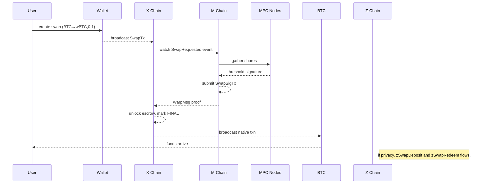
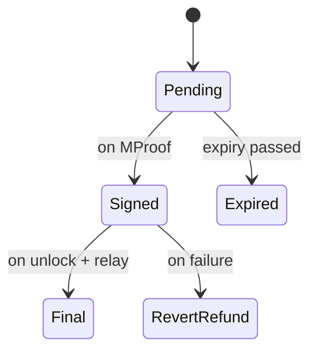

## Abstract

This LP provides a deep-integration blueprint to migrate the legacy swaps REST API (`app/server/src/routes/swaps.ts`) into a fully on-chain workflow across M-Chain, X-Chain, and Z-Chain, eliminating centralized swap servers and off-chain key-managers.

## Motivation

The current REST-based bridge back-end suffers from:
- Centralized swap book in Postgres
- Off-chain signature collection by a separate worker
- Polling and cron jobs for finality tracking

We aim to push swap intent, MPC signing, final settlement, and optional privacy entirely on-chain, enabling stateless front-ends and decentralized swap execution.

## Specification

### 1 Legacy API Recap

The existing bridge back-end exposes HTTP routes:

| Method            | Path                     | Purpose                                                   |
|-------------------|--------------------------|-----------------------------------------------------------|
| POST   /swaps     | create a cross-chain swap| record DB row, key-manager signs                          |
| GET    /swaps/:id | poll swap status         | PENDING / SIGNED / FINAL                                  |
| POST   /swaps/:id/sign     | privileged broadcast MPC signature|
| POST   /swaps/:id/finalize | mark COMPLETED, emit webhook |

### 2 High-Level Chain Roles

| Chain   | Role for swaps                                                                                           |
|---------|----------------------------------------------------------------------------------------------------------|
| X-Chain | `SwapTx` locks escrow funds; emits SwapID = txID; user intent                                     |
| M-Chain | `SwapSigTx` contains aggregate MPC signature + proof of quorum; slashing for non-participation     |
| Z-Chain | (optional) privacy layer: `zSwapDeposit` → commitment; `zSwapRedeem` → shielded withdrawal proof     |

### 3 On-Chain Data Structures

#### 3.1 SwapTx (X-Chain)
```go
type SwapTx struct {
    BaseTx
    SrcChain  uint32
    DstChain  uint32

| Method            | Path                     | Purpose                                                   |
|-------------------|--------------------------|-----------------------------------------------------------|
| POST   /swaps     | create a cross-chain swap| record DB row, key-manager signs                          |
| GET    /swaps/:id | poll swap status         | PENDING / SIGNED / FINAL                                  |
| POST   /swaps/:id/sign     | privileged broadcast MPC signature|
| POST   /swaps/:id/finalize | mark COMPLETED, emit webhook |

Pain points:
1. Swap book in Postgres → trusted central server
2. Signature collection off-chain in Node.js worker
3. Finality tracking via polling and cron jobs

**Goal:** Move this workflow entirely on-chain so front-ends remain stateless.

## 1 High-Level Chain Roles

| Chain   | Role for swaps                                                                                           |
|---------|----------------------------------------------------------------------------------------------------------|
| X-Chain | `SwapTx` locks escrow funds; emits SwapID = txID; user intent                                     |
| M-Chain | `SwapSigTx` contains aggregate MPC signature + proof of quorum; slashing for non-participation     |
| Z-Chain | (optional) privacy layer: `zSwapDeposit` → commitment; `zSwapRedeem` → shielded withdrawal proof     |

After signing on M-Chain, X-Chain light-client proof unlocks escrow and relays native transaction. Privacy flag routes via Z-Chain.

## 2 On-Chain Data Structures

### 2.1 SwapTx (X-Chain)
```go
type SwapTx struct {
    BaseTx
    SrcChain  uint32
    DstChain  uint32
    SrcAsset  AssetID
    DstAsset  AssetID
    Amount    uint64
    MinOut    uint64
    Expiry    uint64
    FeeBps    uint16
    Recipient [32]byte
}
```
Funds lock to SwapFx until SwapSigTx appears; SwapID = txID.

### 2.2 SwapSigTx (M-Chain)
```go
type SwapSigTx struct {
    BaseTx
    SwapID    ids.ID
    MPCAlgo   byte
    Signature []byte
    SigBitmap []byte
    ProofHash [32]byte
}
```
On seeing SwapTx, validators form threshold signature off-chain and submit SwapSigTx on M-Chain.

### 3 Transaction Flow



### 4 RPC Mapping

| Old REST Route        | New Chain RPC Call                     | Chain & Method               |
|-----------------------|----------------------------------------|------------------------------|
| POST /swaps           | dex.swap.submit({txHex})               | X-Chain dex.swap.submit      |
| GET /swaps/:id        | dex.swap.status({swapID})              | X-Chain dex.swap.status      |
| POST /swaps/:id/sign  | (no-op, automated on M-Chain)          |                              |
| POST /swaps/:id/finalize | (no-op, automated on SwapSig detection)|                          |

### 5 Validator & MPC Stack

```text
X-Chain Node (luxd + DexFx)  <-->  dexfx plugin verifies SwapTx, watches proofs
M-Chain Node (luxd + mpckeyd) <-->  mpckeyd holds key shares, exposes gRPC sign_swap
```

### 6 State Diagrams



### 7 Privacy Add‑On

Privacy flag triggers Z-Chain peg, shielded mint, and zSwapRedeem → zk-proof withdrawal.

### 8 Workflows & Tooling

| Legacy Server Code     | New On-Chain Location                    |
|------------------------|-------------------------------------------|
| DB Swaps table         | dex.swap.history indexer                  |
| Signature worker       | mpckeyd daemon on M-Chain                 |
| REST routes            | JSON-RPC + WS dex.swap.*                  |
| Polling & webhooks     | WS push feeds and RPC responses           |

## Rationale

This design fully decentralizes swap logic by moving book-keeping, MPC signing, and final settlement on-chain, removing trust in centralized servers and enabling light clients to participate via standard RPC and WebSocket feeds.

## Backwards Compatibility

Swap features are gated behind the DexFx/SwapFx extension and RPC methods; nodes without the extension operate unchanged.

## Security Considerations

- Bound `SwapSigTx` relayer rights (multisig) to prevent unauthorized commits
- Enforce expiry-based slashing on MPC nodes for liveness guarantees
- Use gas and data limits on proofs to avoid DoS

## Economic Impact (optional)

Operator MPC signers stake LUX and earn swap fees. Users pay gwei-priced fees in LUX for each swap transaction.

## Open Questions (optional)

1. Fee model for failed external transfers?  
2. Optimal expiry window vs on-chain gas cost?  
3. Depth of Z-Chain privacy integration?  

MPC signers burn stake on misbehavior; relayer gas paid by fees built into SwapTx. Users pay gwei-priced fees in native LUX.

## Implementation

### On-Chain Swap Architecture

**Location**: `~/work/lux/node/vms/avm/` and `~/work/lux/node/vms/mvm/`
**GitHub**:
- [`github.com/luxfi/node/tree/main/vms/avm/plugins/swap`](https://github.com/luxfi/node/tree/main/vms/avm/plugins/swap) - X-Chain swaps
- [`github.com/luxfi/node/tree/main/vms/mvm`](https://github.com/luxfi/node/tree/main/vms/mvm) - M-Chain MPC signing

**Core Swap Components**:
- [`plugins/swap/swap_tx.go`](https://github.com/luxfi/node/blob/main/vms/avm/plugins/swap/swap_tx.go) - SwapTx codec
- [`plugins/swap/swap_fx.go`](https://github.com/luxfi/node/blob/main/vms/avm/plugins/swap/swap_fx.go) - SwapFx plugin
- [`plugins/swap/rpc.go`](https://github.com/luxfi/node/blob/main/vms/avm/plugins/swap/rpc.go) - RPC interface

**M-Chain Signing**:
- Location: `~/work/lux/node/vms/mvm/`
- [`vm.go`](https://github.com/luxfi/node/blob/main/vms/mvm/vm.go) - M-Chain VM
- [`service/mpc.go`](https://github.com/luxfi/node/blob/main/vms/mvm/service/mpc.go) - MPC signing coordination

**SwapTx State Machine**:
```go
// From plugins/swap/swap_fx.go
type SwapStatus uint8

const (
    PENDING SwapStatus = iota
    SIGNED
    FINAL
    EXPIRED
    FAILED
)

func (tx *SwapTx) Status() SwapStatus {
    // Check if SwapSigTx exists on M-Chain
    if mproof := getLightClientProof(tx.SwapID); mproof != nil {
        if isExpired(tx) {
            return EXPIRED
        }
        return FINAL
    }

    if time.Since(tx.CreatedAt) > SWAP_TIMEOUT {
        return EXPIRED
    }

    return PENDING
}
```

**Testing**:
```bash
cd ~/work/lux/node
go test ./vms/avm/plugins/swap/... -v
go test ./vms/mvm/... -v

# Load test with concurrent swaps
cd ~/work/lux/node
go test -run TestSwapLoadTest -timeout=5m ./vms/avm/plugins/swap/...
```

### Swap RPC Endpoints

**X-Chain dex.swap.* Methods**:
- `dex.swap.submit({txHex})` - Submit SwapTx
- `dex.swap.status({swapID})` - Query swap status (PENDING/SIGNED/FINAL)
- `dex.swap.history({address,limit})` - Swap history for address

**Performance SLAs**:
- Swap submission: <100 ms
- Status query: <20 ms
- MPC signing latency: <5 seconds (3-of-5 threshold)

## Open Questions (optional)

1. How to manage fee refund or insurance for failed external TXs?
2. Optimal expiry windows vs on-chain gas costs?
3. Z-Chain integration depth vs UX tradeoffs?

## Copyright

Copyright and related rights waived via [CC0](https://creativecommons.org/publicdomain/zero/1.0/).