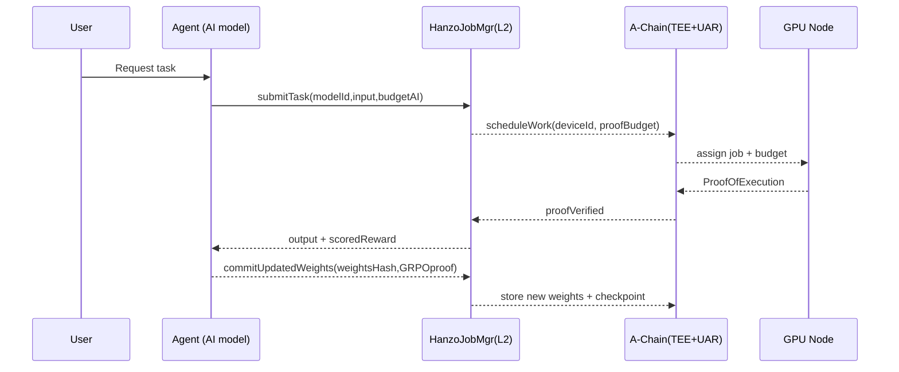
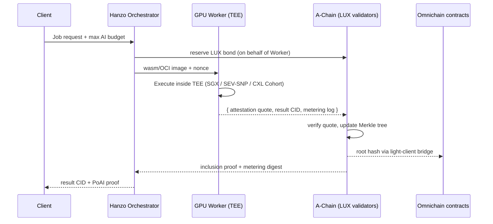

## Abstract

This LP specifies the A-Chain (Attestation Chain), Lux Network's attestation layer that provides network-wide verification of trusted execution environments (TEEs) across all compute classes (CPU, GPU, NPU, ASIC). The A-Chain serves as the single source of truth for device attestation, using LUX as its native gas token while enabling specialized tokens (AI Coin, ZOO) for application-layer orchestration.

## Motivation

As Lux Network evolves to support AI workloads, decentralized compute, and trusted execution, a unified attestation layer becomes critical for:

1. **Security**: Single root of trust for all TEE devices across the network
2. **Interoperability**: Any Lux subnet can verify device trustworthiness
3. **Efficiency**: Avoid duplicate attestation registries across chains
4. **Economics**: Clear separation between security (LUX) and application tokens

## Specification

### 1. A-Chain Architecture

| Aspect | Design Choice | Rationale |
|--------|---------------|-----------|
| Scope | Cover all compute classes—CPU, GPU, NPU, ASIC—via single attestation trait (`AttestedDevice`) | Future-proofs the network; devices register once regardless of accelerator type |
| On-chain anchor | A-Chain remains the ledger of record. Validators pay gas in LUX only | Keeps system-critical security layer tied to Lux economics and simplifies gas accounting |
| Root-of-trust | Chain stores root CA bundle for every supported TEE vendor (Intel SGX, AMD SEV-SNP, NVIDIA Confidential Computing, ARM CCA) | Bundle can be upgraded by governance; every attestation proof verified against these roots on-chain |
| Proof object | `ProofOfExecution { device_id, cpu_quote, gpu_quote?, nonce, job_hash, output_hash }` | Supports pure-CPU jobs (gpu_quote=nil) or hybrid CPU + GPU |
| Verification path | a) EVM precompile 0xAAA... verifies quote signature → b) records device_id→status → c) emits AttestationVerified event | Gas-efficient native code; data available to smart contracts or off-chain indexers |
| Global state | Attestation Registry (AR) is on-chain map of device-ids → trust status, score, last-seen | Every L2 or app-chain queries same source of truth; avoids duplicate registries |

### 1.1 Attestation Flow

```solidity
interface IAttestationChain {
    struct ProofOfExecution {
        bytes32 deviceId;
        bytes cpuQuote;      // TEE quote from CPU
        bytes gpuQuote;      // Optional: TEE quote from GPU
        uint256 nonce;
        bytes32 jobHash;
        bytes32 outputHash;
    }
    
    struct DeviceStatus {
        bool attested;
        uint8 trustScore;    // 0-100
        uint256 lastSeen;
        address operator;
        TEEVendor vendor;
    }
    
    function verifyAttestation(ProofOfExecution calldata proof) external returns (bool);
    function getDeviceStatus(bytes32 deviceId) external view returns (DeviceStatus memory);
    function updateRootCA(TEEVendor vendor, bytes calldata newRootCA) external onlyGovernance;
}
```

**Simplified Flow:**
1. Node start-up → signs CPU & GPU quotes
2. Calls `verifyAttestation(ProofOfExecution)` on A-Chain
3. Precompile checks vendor roots → updates AR → returns attested=true
4. Any chain (Hanzo L2, Zoo L2, etc.) calls `A-Chain.getStatus(device_id)` to accept/reject node

### 2. Two-Token Economic Separation

| Layer | Native Fee Token | Purpose |
|-------|------------------|---------|
| A-Chain (attestation & root-of-trust) | LUX | Security budget, validator rewards, attestation gas |
| Hanzo.Network orchestration | AI Coin (AI) | Task pricing, agent budgets, GRPO learning rewards |
| Zoo.Network | ZOO (or sub-token) | Avatar micro-economy, in-world items, tips |

**Rationale:**
- **LUX** anchors the entire Lux security model. Using one gas token for attestation ensures predictable validator economics
- **AI Coin** remains free to evolve inside Hanzo's domain (dynamic task-pricing, staking, reputation)
- Both AI Coin and ZOO are ERC-20s on C-Chain; the X-Chain DEX offers atomic LUX↔AI Coin and LUX↔ZOO swaps

### 3. Oracle-Based Fee Discovery

A-Chain publishes two canonical oracles:

```solidity
interface IComputePriceOracle {
    struct GPUPrice {
        string gpuClass;      // "A100", "H100", "B200"
        uint256 pricePerSec;  // in USD cents
        uint256 lastUpdate;
    }
    
    struct EnergyPrice {
        string region;        // "us-east", "eu-west", "global"
        uint256 kWhPrice;     // in USD cents
        uint256 lastUpdate;
    }
    
    function getGPUPrice(string calldata gpuClass) external view returns (GPUPrice memory);
    function getEnergyPrice(string calldata region) external view returns (EnergyPrice memory);
    function updatePrices(GPUPrice[] calldata gpu, EnergyPrice[] calldata energy) external onlyOracle;
}
```

**Price Discovery:**
- Off-chain workers post signed quotes
- Quorum and slashing rules ensure honest reporting
- Contracts derive: `compute_fee = secs * GPU_PRICE + energy_markup`
- X-Chain DEX converts USD-equivalent to token amounts

### 4. GRPO-Style Continuous Learning Loop



**Key Points:**
- Budget funded in AI Coin; smart contract escrows and streams micro-payments per proof
- GRPOproof (gradient or reward delta) is hashed and lodged on-chain for future audits
- All GPU Nodes earn AI Coin; only attested devices accepted (verified via AR)

### 5. Omnichain Cryptographic Roots

1. **Attestation root set** lives on A-Chain
2. Other Lux subnets reference the Merkle root of the AR via IBC-style "light client" contracts
3. Periodic headers from A-Chain → committed on P-Chain for network-wide finality
4. Any chain can verify `{device_id,status}` in O(log n) via Merkle proof

```solidity
interface IAttestationLightClient {
    function verifyDeviceProof(
        bytes32 deviceId,
        DeviceStatus calldata status,
        bytes32[] calldata merkleProof
    ) external view returns (bool);
    
    function updateRoot(
        bytes32 newRoot,
        uint256 blockHeight,
        bytes calldata signatures
    ) external;
}
```

**Outcome:** Entire Lux ecosystem (and bridged EVM chains) shares single cryptographic root-of-trust for TEE devices.

### 6. A-Chain Architecture

#### 6.1 Core Components

- **Consensus**: Uses Lux Consensus (same as P/X/C-chains) for consistency
- **VM**: Modified EVM with attestation-specific precompiles
- **State**: Primarily the AR and oracle price feeds
- **Gas**: LUX-denominated, with attestation operations having fixed gas costs

#### 6.2 Precompiled Contracts

| Address | Function | Gas Cost |
|---------|----------|----------|
| 0xAAA... | TEE quote verification | 50,000 |
| 0xAAB... | Merkle proof generation | 10,000 |
| 0xAAC... | Cross-chain state sync | 30,000 |

#### 6.3 Governance

- Root CA updates require 2/3 validator approval
- Oracle operator selection via stake-weighted voting
- Emergency pause mechanism for security incidents

## Design Playbook

This section provides the protocol engineering team with a comprehensive implementation guide for integrating:
- **Hanzo Network** – the execution/orchestration layer that mints and burns AI coin
- **A-Chain** – a compact attestation side-chain that mints LUX, stores global TEE attestations, and pushes a lightweight cryptographic root to every other chain
- **TEE-backed Proof-of-AI (PoAI)** – hardware-anchored proof that CPU/GPU work was executed inside a trusted enclave
- **Omnichain fee & settlement rails** – oracle-fed resource pricing, cross-chain AMM, and root-of-trust relay contracts

### 7. Role Separation & Token Utility

| Layer | Native Asset | Main Duties | Why a Distinct Asset? |
|-------|--------------|-------------|----------------------|
| Hanzo Network (execution) | AI | • Task scheduling & market-clearing for compute jobs<br>• Pay per-second metering (compute, memory, bandwidth)<br>• Collateral for malicious-result insurance | Keeps fast-fee accounting off the attestation chain; supply expands/contracts with job volume |
| A-Chain (attestation) | LUX | • Stake/slash validators that run attestation TEEs<br>• Record Merkle commitments of every enclave session<br>• Governance over TEE vendor lists, quorum sizes, PoAI rules | Must be extremely stable & long-lived (think "main net root-of-trust") |

**Guiding Rule**: AI is "gas"; LUX is "security bond". Compute operators earn AI, but must post & periodically roll LUX stake to the attestation layer.

### 8. TEE Attestation Pipeline (CPU, GPU, ASIC-friendly)



#### 8.1 Attestation Contents

| Field | Purpose |
|-------|---------|
| enclave_id (MRENCLAVE/CHIP-ID) | Binds to whitelisted TEE firmware version |
| job_id & nonce | Prevent replay between jobs |
| metering_log | (ΔCPU, ΔGPU, ΔRAM, ΔNET, wall-time) |
| result_hash | CID/IPFS multihash of job output |
| timestamp | Cross-signed with enclave monotonic counter |
| signature | Signed by hardware root key (SGX Quoting Enclave or SEV-SNP Cert-Chain) |

**A-Chain validators verify:**
- Hardware root certificate chain (Intel PCS / AMD ARK)
- Firmware version against allowed-TEE white-list set by governance
- metering_log within operator's prepaid AI allowance
- Merkle-ize (attestation_hash || worker_addr) into the Attestation Root per block

### 9. Global Root Propagation (Omnichain Cryptographic Roots)

1. **Each A-Chain block produces:**
   - `attestationRoot` (Merkle root of all quotes)
   - `stateRoot` (Standard chain state root)

2. **A tiny RootRelayer light-client contract posts these roots to:**
   - Hanzo Network L1
   - EVM L2s where compute customers live
   - Cosmos/IBC zones
   (Implemented once, reused everywhere; uses succinct SPV proofs)

3. **Downstream chains import the root to validate PoAI proofs included in bridging txs**

**Tip**: Use a client-update committee (e.g., EigenLayer AVSs) so only ⅔+ signatures are needed on each destination chain instead of full on-chain light client.

### 10. Dynamic Resource Pricing

#### 10.1 Oracle Basket

| Oracle Feed | Source | Update Freq |
|-------------|--------|-------------|
| GPU spot ($/sec) | Akash, AWS G5, Vast.ai median | 15 min |
| CPU spot ($/sec) | AWS/GCP/Hetzner median | 30 min |
| Electricity ($/kWh) | EIA/ENTSO-E API | 1 h |
| LUX/USD, AI/USD | Chainlink CCIP, on-chain DEX TWAP | real-time |

#### 10.2 Hamiltonian AMM (Ψ·Θ = κ)
- **Ψ** = token float (AI or LUX)
- **Θ** = outstanding work units (GPU-seconds, CPU-seconds)
- **κ** = oracle-anchored invariant

When GPU demand overheats (Θ↑), price (# AI per sec) rises automatically. A-Chain governance can update κ if oracle median drifts.

### 11. Staking & Slashing Model

| Condition | Slash -LUX? | Forfeit -AI? | Notes |
|-----------|-------------|--------------|-------|
| Invalid enclave quote | 100% LUX bond | Job refunded | Critical security violation |
| Over-metering (claim < actual) | Pro-rata LUX burn | Additional AI fine | Detect via dual attestation of watchdog enclaves |
| Missed deadline | None | 10% AI penalty | Incentivizes timely delivery |
| Reorg/equivocation on A-Chain | 5% LUX slashed validator-set-wide | N/A | Tendermint-style penalty |

Staked LUX sits in A-Chain smart-contract; slashing tx triggered automatically by on-chain detection logic (e.g., incorrect Merkle proof).

### 12. Implementation Milestones

| Phase | Deliverable | Tech Stack |
|-------|-------------|------------|
| M0 – Prep | Merge finished luxfi/db layer, Pebble+Badger tests green | Go 1.22, Pebble v0.14, Badger v4 |
| M1 – A-Chain genesis | Minimal PoS chain with LUX staking, attestation tx type, root relayer to Hanzo L1 | Cosmos-SDK or Subnet-EVM with custom precompile |
| M2 – Enclave SDK | Rust/Go wasi runtime, metering syscalls, quote wrapper library | SGX/DCAP, SEV-SNP |
| M3 – Orchestrator MVP | Match engine + AI coin escrow, PoAI verification against A-Chain SPV | Hanzo Network L1 (Rust, Tendermint-lite) |
| M4 – Oracle basket | Deployed Chainlink jobs, push feeds to A-Chain | Solidity, CCIP |
| M5 – Slashing & insurance | On-chain insurance pool, governance UI | React front-end, CosmWasm contracts |
| M6 – Cross-chain roll-out | RootRelayer on 3 EVMs + 1 Cosmos zone | Gelato/EigenLayer AVS |

### 13. Security & Audit Checklist

1. **TEE vendor coverage** – track CVEs; governance hot-patch list of banned MRENCLAVEs
2. **Key transparency** – publish signing key rotations to A-Chain and mirror to Git transparency log
3. **Deterministic metering** – identical wasm runtime in enclave & referee nodes; regression tests hashed in CI
4. **Oracle fault tolerance** – median of ≥5 feeds; fallback to 24h TWAP; circuit-breaker on >2× deviation
5. **Root-relayer liveness** – multi-sig of at least 3 independent operators; slashable via EigenLayer if root not updated for N blocks

### Final Thoughts

- Keep LUX scarcity and security separate from the AI variable-supply gas: this avoids feedback loops between compute demand spikes and validator incentives
- By anchoring every enclave proof in A-Chain and relaying a single root, downstream chains verify compute work with one 32-byte proof instead of full logs
- The AMM + oracle model lets you add new resource classes (RAM-GB-sec, NVMe-IO-sec) just by adding a feed and mapping to Θ units—no consensus upgrade needed

## Rationale

### Why Separate A-Chain?

1. **Security Isolation**: Attestation is critical infrastructure that shouldn't compete for block space with DeFi or NFTs
2. **Economic Clarity**: LUX for security, application tokens for services
3. **Upgrade Path**: Can evolve attestation standards without affecting other chains

### Why Not Use C-Chain?

1. **State Bloat**: AR would add significant state to already large C-Chain
2. **Gas Competition**: Attestation ops would compete with DeFi transactions
3. **Specialized Needs**: Attestation requires specific precompiles and oracle infrastructure

### Token Economic Design

The two-token model prevents:
- Security budget volatility from application token speculation
- Attestation costs affecting AI task pricing
- Complex multi-token gas accounting

## Backwards Compatibility

A-Chain is a new addition to Lux Network and maintains compatibility by:
- Using standard Lux Consensus protocol
- Exposing EVM-compatible interfaces
- Supporting existing cross-chain messaging (Teleport/Warp)

## Test Cases

### Attestation Tests

```typescript
describe("A-Chain Attestation", () => {
    it("should verify valid Intel SGX quote", async () => {
        const proof = {
            deviceId: "0x123...",
            cpuQuote: sgxQuote,
            gpuQuote: null,
            nonce: 1,
            jobHash: "0xabc...",
            outputHash: "0xdef..."
        };
        
        const result = await aChain.verifyAttestation(proof);
        expect(result).toBe(true);
        
        const status = await aChain.getDeviceStatus(proof.deviceId);
        expect(status.attested).toBe(true);
        expect(status.trustScore).toBeGreaterThan(80);
    });
    
    it("should reject invalid attestation", async () => {
        const proof = createInvalidProof();
        await expect(aChain.verifyAttestation(proof)).toRevert();
    });
});
```

### Cross-Chain Verification

```typescript
it("should verify device status from L2", async () => {
    // First attest on A-Chain
    await aChain.verifyAttestation(validProof);
    
    // Get merkle proof
    const proof = await aChain.getMerkleProof(deviceId);
    
    // Verify on Hanzo L2
    const verified = await hanzoL2.verifyDeviceProof(
        deviceId,
        deviceStatus,
        proof
    );
    expect(verified).toBe(true);
});
```

### Oracle Integration

```typescript
it("should calculate compute costs correctly", async () => {
    // Update oracle prices
    await oracle.updatePrices([
        { gpuClass: "H100", pricePerSec: 100 }, // $0.01/sec
    ], [
        { region: "us-east", kWhPrice: 10 }     // $0.001/kWh
    ]);
    
    // Calculate 60 second job cost
    const gpuCost = 60 * 100;  // 6000 cents
    const energyCost = 60 * 0.5 * 10; // 300 cents (0.5kW power)
    const totalCost = gpuCost + energyCost; // $63
    
    // Convert to AI Coin via DEX
    const aiCoinAmount = await dex.getAmountOut(totalCost, "USD", "AI");
    expect(aiCoinAmount).toBeGreaterThan(0);
});
```

## Security Considerations

### Attestation Security

1. **Quote Replay**: Prevented by nonces and time windows
2. **Vendor Compromise**: Mitigated by multi-vendor support and governance-controlled updates
3. **Oracle Manipulation**: Quorum requirements and stake slashing

### Economic Security

1. **Gas Pricing**: Fixed gas costs prevent attestation spam
2. **Oracle Gaming**: Economic penalties exceed potential profits
3. **Cross-Chain**: Light client security relies on A-Chain validator set

### Operational Security

1. **Key Management**: TEE keys never leave secure enclaves
2. **Monitoring**: Real-time anomaly detection for attestation patterns
3. **Emergency Response**: Governance can pause attestation for compromised vendors

## Implementation

### Phase 1: Core A-Chain Launch
- Basic UAR functionality
- CPU attestation only (Intel SGX, AMD SEV)
- Manual oracle updates

### Phase 2: GPU Support
- NVIDIA Confidential Computing integration
- GPU quote verification precompiles
- Automated oracle system

### Phase 3: Cross-Chain Integration
- Light clients on all Lux subnets
- Merkle proof optimization
- Batch attestation support

### Phase 4: Advanced Features
- Multi-party attestation
- Reputation scoring
- Attestation insurance pools

## Developer Toolkit

```bash
# Spin up local attested devnet
luxfi/node --a-chain --tee=off # research mode

# Register GPU
lux-cli attest --device-id X --vendor nvidia

# Query UAR
curl /a-chain/uar/<deviceId>

# Pay for compute from Python agent
web3.py -> sendTransaction(to=HanzoJobMgr, value=fee_in_AI)

# Swap LUX→AI Coin for gas
viem writeContract(DEX.swap, params)

# Push GRPO update
hanzo-sdk ai.submit_update(weightsHash, rewardProof)
```

## Summary

The A-Chain provides Lux Network with a unified, secure foundation for trusted execution across all compute types. By separating attestation (LUX) from application economics (AI Coin, ZOO), the system achieves:

- **Single source of truth** for device trustworthiness
- **Clean economic separation** between security and services  
- **Network-wide interoperability** through cryptographic proofs
- **Future-proof design** supporting new TEE vendors and compute types

This design enables Lux to scale to many AI-centric chains without duplicating trust infrastructure or fragmenting liquidity.

## References

- [LP-10: P-Chain Specification](./lp-10.md)
- [LP-11: X-Chain Specification](./lp-11.md)
- [LP-12: C-Chain Specification](./lp-12.md)
- [LP-75: TEE Integration Standard](./lp-75.md)
- Intel SGX Documentation
- NVIDIA Confidential Computing
- AMD SEV-SNP Specification

## Copyright

Copyright and related rights waived via [CC0](../LICENSE.md).