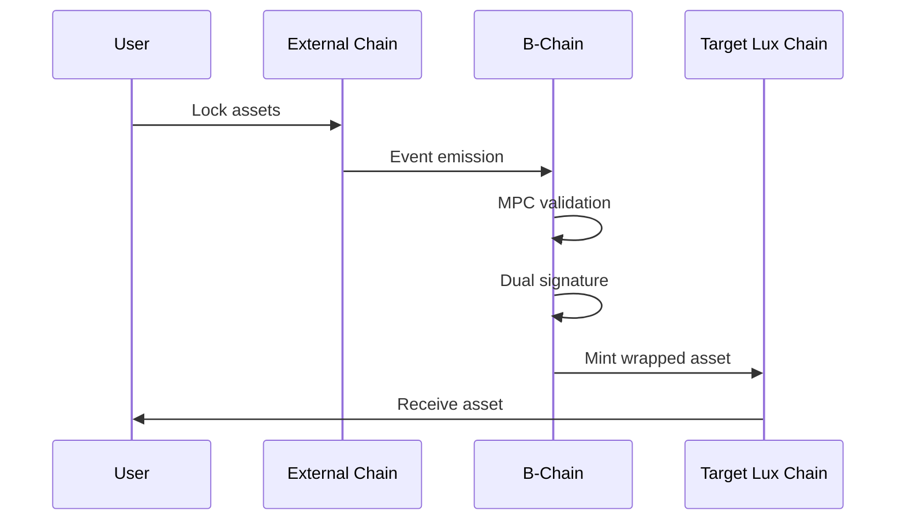
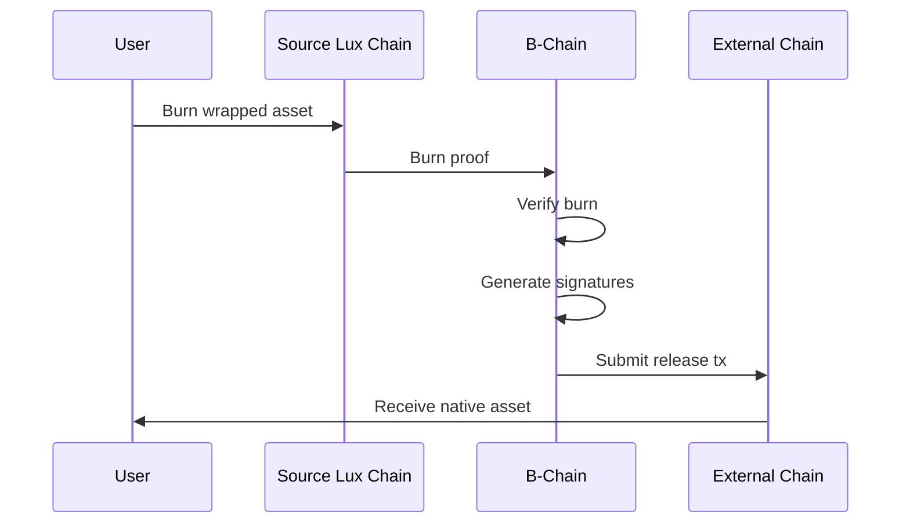

## Abstract

This LP specifies the B-Chain (Bridge Chain), Lux Network's dedicated blockchain for secure cross-chain asset transfers. B-Chain implements MPC-based custody using CGG21 threshold signatures extended with Ringtail for quantum safety, providing a unified bridge infrastructure for all external chain connections.

## Motivation

Current bridge architectures face several challenges:
1. **Security Fragmentation**: Multiple bridge implementations with varying security models
2. **Quantum Vulnerability**: Classical ECDSA signatures vulnerable to future quantum attacks
3. **Operational Complexity**: Managing bridges across multiple chains independently
4. **Resource Competition**: Bridge operations competing with other chain activities

B-Chain addresses these by providing a dedicated, quantum-safe bridge infrastructure.

## Specification

### Chain Architecture

B-Chain is a specialized Lux subnet optimized for bridge operations:

```
┌─────────────────────────────────────────────────────────┐
│                    B-Chain Architecture                   │
├─────────────────────────┬───────────────────────────────┤
│   External Chains       │        B-Chain Core           │
├─────────────────────────┼───────────────────────────────┤
│ • Ethereum              │ • MPC Custody (CGG21)         │
│ • Bitcoin               │ • Ringtail Quantum Extension  │
│ • BSC                   │ • Asset Registry              │
│ • Polygon               │ • Threshold Signing           │
│ • Arbitrum              │ • Bridge State Machine        │
│ • Cosmos                │ • Slashing & Rewards          │
└─────────────────────────┴───────────────────────────────┘
                                  │
                    ┌─────────────┴─────────────┐
                    │     Lux Internal Chains   │
                    │  (C, X, P, A, M, Q, Z)    │
                    └───────────────────────────┘
```

### Core Components

#### 1. MPC Custody Layer

```go
type BridgeValidator struct {
    NodeID       ids.NodeID
    ClassicalKey *ecdsa.PublicKey  // CGG21 key share
    QuantumKey   *ringtail.PublicKey // Ringtail key share
    Stake        uint64
    Reputation   uint32
}

type CustodyGroup struct {
    Validators      []BridgeValidator
    Threshold       uint32  // t-of-n threshold
    ClassicalPubKey *ecdsa.PublicKey
    QuantumPubKey   *ringtail.PublicKey
}
```

#### 2. Dual-Signature Bridge Operations

```solidity
interface IBridgeChain {
    struct BridgeRequest {
        uint256 nonce;
        address sourceChain;
        address destChain;
        address asset;
        uint256 amount;
        address recipient;
        bytes metadata;
    }
    
    struct DualSignature {
        bytes cgg21Sig;      // Classical threshold signature
        bytes ringtailSig;   // Quantum-safe threshold signature
    }
    
    function initiateBridge(BridgeRequest calldata request) external payable;
    function completeBridge(BridgeRequest calldata request, DualSignature calldata sig) external;
    function verifyDualSignature(bytes32 messageHash, DualSignature calldata sig) external view returns (bool);
}
```

### Quantum-Safe Extension

B-Chain implements a dual-signature scheme during the quantum transition period:

1. **Phase 1 (Current)**: CGG21 ECDSA only
2. **Phase 2 (Transition)**: Both CGG21 and Ringtail signatures required
3. **Phase 3 (Post-Quantum)**: Ringtail only after quantum computers pose real threat

```go
func (b *Bridge) Sign(request BridgeRequest) (*DualSignature, error) {
    // Phase detection
    phase := b.GetQuantumPhase()
    
    sig := &DualSignature{}
    
    // Always sign with classical
    if phase >= Phase1 {
        sig.CGG21Sig = b.signCGG21(request)
    }
    
    // Add quantum signature in transition
    if phase >= Phase2 {
        sig.RingtailSig = b.signRingtail(request)
    }
    
    return sig, nil
}
```

### Asset Flow

#### Inbound (External → Lux)



#### Outbound (Lux → External)



### Consensus Parameters

```go
var DefaultBridgeParams = Parameters{
    // Validator set
    MinValidators:      21,
    MaxValidators:      100,
    
    // Threshold requirements
    SigningThreshold:   67,  // 67% for signing
    SecurityThreshold:  75,  // 75% for security actions
    
    // Timing
    ObservationPeriod:  30 * time.Second,
    SigningTimeout:     60 * time.Second,
    
    // Economics
    MinStake:          100_000 * units.LUX,
    BridgeFeeRate:     30,  // 0.3% in basis points
    RewardSplit:       50,  // 50% to validators, 50% to treasury
}
```

### State Management

B-Chain maintains several critical state components:

```go
type BridgeState struct {
    // Asset tracking
    AssetRegistry    map[ChainID]map[Address]AssetInfo
    TotalValueLocked map[AssetID]*big.Int
    
    // Request tracking  
    PendingRequests  map[RequestID]*BridgeRequest
    CompletedTxs     map[TxHash]CompletionProof
    
    // Validator performance
    ValidatorStats   map[NodeID]*PerformanceMetrics
    SlashingEvents   []SlashingRecord
}
```

### Security Model

#### 1. Economic Security
- Validators stake LUX tokens
- Slashing for misbehavior (double-signing, downtime)
- Insurance fund from bridge fees

#### 2. Cryptographic Security
- **Classical**: CGG21 threshold ECDSA with identifiable abort
- **Quantum**: Ringtail lattice-based signatures
- **Hybrid**: Both signatures required during transition

#### 3. Operational Security
- Multi-layer validation (event → consensus → signature)
- Time-locked withdrawals for large amounts
- Emergency pause mechanism

### Fee Structure

```solidity
struct FeeConfig {
    uint256 baseFee;        // Minimum fee in LUX
    uint256 percentageFee;  // Basis points (30 = 0.3%)
    uint256 maxFee;         // Cap on fees
    
    // Distribution
    uint256 validatorShare; // % to active signers
    uint256 treasuryShare;  // % to insurance fund
    uint256 stakerShare;    // % to all stakers
}
```

## Rationale

### Why Dedicated Bridge Chain?

1. **Security Isolation**: Bridge operations isolated from other activities
2. **Specialized Optimization**: Consensus tuned for bridge requirements
3. **Resource Guarantee**: No competition for block space
4. **Unified Management**: Single point for all external connections

### Why Dual Signatures?

1. **Smooth Transition**: No disruption when quantum threat emerges
2. **Backwards Compatible**: Existing systems continue working
3. **Future Proof**: Ready for post-quantum world
4. **Risk Mitigation**: Protection even if one scheme compromised

### Why CGG21 + Ringtail?

1. **CGG21**: Best-in-class classical threshold ECDSA
2. **Ringtail**: Efficient lattice-based quantum-safe signatures
3. **Combined**: Optimal security during transition period

## Backwards Compatibility

B-Chain maintains compatibility with:
- Existing bridge contracts on external chains
- Current wrapped asset standards (LRC-20)
- Legacy bridge APIs during migration period

Migration path:
1. Deploy B-Chain with CGG21 only
2. Migrate existing bridge operations
3. Add Ringtail in protocol upgrade
4. Deprecate legacy bridges

## Test Cases

### Bridge Operation Tests

```typescript
describe("B-Chain Bridge Operations", () => {
    it("should complete ETH to Lux bridge", async () => {
        // Lock ETH on Ethereum
        const lockTx = await ethBridge.lock(amount, luxAddress);
        
        // Wait for B-Chain observation
        await waitForObservation(lockTx.hash);
        
        // Verify wrapped ETH minted on C-Chain
        const balance = await wrappedETH.balanceOf(luxAddress);
        expect(balance).to.equal(amount);
    });
    
    it("should require dual signatures in Phase 2", async () => {
        await bChain.setQuantumPhase(2);
        
        const request = createBridgeRequest();
        const sig = await bChain.sign(request);
        
        expect(sig.cgg21Sig).to.not.be.empty;
        expect(sig.ringtailSig).to.not.be.empty;
        
        const valid = await bChain.verifyDualSignature(request, sig);
        expect(valid).to.be.true;
    });
});
```

### Security Tests

```typescript
it("should slash validator for double signing", async () => {
    const validator = await bChain.getValidator(nodeId);
    const initialStake = validator.stake;
    
    // Attempt double sign
    await expectRevert(
        validator.signConflicting(request1, request2),
        "Double signing detected"
    );
    
    // Verify slashing
    const slashed = await bChain.getValidator(nodeId);
    expect(slashed.stake).to.be.lessThan(initialStake);
});
```

## Security Considerations

### Bridge-Specific Threats

1. **Eclipse Attacks**: Isolating honest validators
   - Mitigation: Diverse network topology requirements
   
2. **Long-Range Attacks**: Rewriting bridge history
   - Mitigation: Checkpointing to other Lux chains
   
3. **Quantum Timeline**: Sudden quantum breakthrough
   - Mitigation: Dual signatures, rapid upgrade capability

### Operational Security

1. **Key Management**: Hardware security modules for validator keys
2. **Monitoring**: Real-time anomaly detection
3. **Incident Response**: Automated pause mechanisms
4. **Audit Trail**: Immutable bridge operation history

## Implementation

### Phase 1: Core B-Chain (Q1 2025)
- Launch with CGG21 MPC
- Migrate existing bridges
- Basic asset registry

### Phase 2: Quantum Extensions (Q2 2025)
- Add Ringtail signatures
- Dual signature validation
- Quantum phase governance

### Phase 3: Advanced Features (Q3 2025)
- Cross-chain DEX integration
- Programmable bridge logic
- Advanced fee models

## References

- [LP-13: M-Chain MPC Specification](./lp-13.md)
- [LP-14: CGG21 Threshold Signatures](./lp-14.md)
- [LP-15: MPC Bridge Protocol](./lp-15.md)
- [LP-75: TEE Integration Standard](./lp-75.md)
- CGG21 Paper: "UC Non-Interactive, Proactive, Threshold ECDSA"
- Ringtail Paper: "Practical Lattice-Based Threshold Signatures"

## Copyright

Copyright and related rights waived via [CC0](../LICENSE.md).