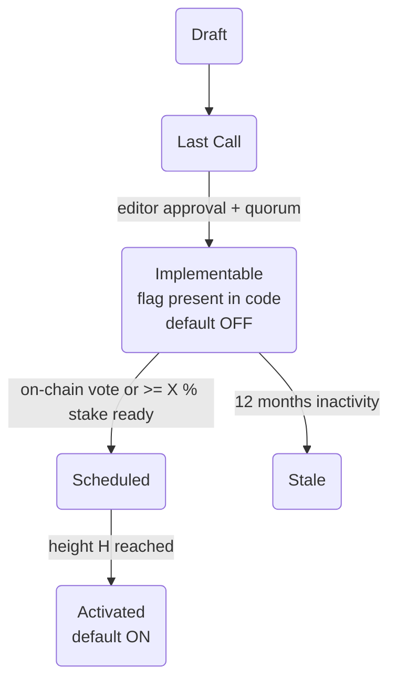

## Abstract

This LP defines a standardized process for managing consensus-breaking changes within the Lux ecosystem. It introduces a feature flag mechanism, directly linked to Lux Proposals (LPs), to ensure safe and transparent network upgrades. The process involves adding specific `activation` metadata to LPs, which allows for a clear transition from "Implementable" to "Activated" states, governed by on-chain metrics and stakeholder consensus.

## Motivation

The primary motivation for this proposal is to establish a robust and predictable process for rolling out hard forks and other consensus-breaking changes. By tying every such change to an LP-defined feature flag, we achieve:

*   **Clarity and Transparency:** The codebase becomes the single source of truth for what features are included in a release and when they are scheduled to activate.
*   **Safety:** Feature flags allow for new consensus rules to be included in a release but remain dormant until a specific activation height is reached and a super-majority of the network has signaled readiness. This minimizes the risk of network splits.
*   **Decentralized Governance:** The activation of features is tied to on-chain governance mechanisms, such as voting or stake-based signaling, giving the community direct control over the evolution of the protocol.
*   **Improved Coordination:** The process eliminates the need for out-of-band coordination for network upgrades, making the process more efficient and less error-prone.

## Specification

### LP Front-Matter

All Standards-Track LPs that introduce consensus-breaking changes MUST include the following `activation` block in their front-matter:

```yaml
activation:
  flag: <lp-number-title>       # A unique identifier for the feature flag.
  hfName: "<fork-name>"         # An optional name for the hard fork.
  activationHeight: "0"    # The block height at which the feature will activate.
```

### Activation Section

Furthermore, a dedicated `## Activation` section must be included in the LP, providing the following details:

| Parameter          | Value                                           |
|--------------------|-------------------------------------------------|
| Flag string        | The canonical string for the feature flag.      |
| Default in code    | The default state of the flag (e.g., `false` until activation). |
| Deployment branch  | The git branch containing the implementation.   |
| Roll-out criteria  | The conditions for activation (e.g., stake signaling). |
| Back-off plan      | The contingency plan if roll-out criteria are not met. |

### Governance Flow

The transition of an LP through its lifecycle is as follows:



The decision to move an LP from `Implementable` to `Scheduled` will be handled by a separate meta-LP or a governance transaction.

## Rationale

This process is heavily inspired by the successful implementation of similar mechanisms in other blockchain ecosystems, such as Avalanche's ACPs. It provides a clear and tested path for network upgrades. The choice of a feature-flag-based system allows for a high degree of flexibility and safety, which is paramount for a network of Lux's scale and complexity.

## Backwards Compatibility

This proposal is backwards-compatible as it only introduces new informational requirements for LPs and does not alter any existing network behavior.

## Security Considerations

The security of this process relies on the integrity of the governance mechanism that schedules feature activations. It is crucial that the on-chain voting or signaling process is secure and resistant to manipulation. Additionally, the implementation of the feature flags in the node software must be carefully audited to prevent any potential vulnerabilities.

## Copyright

Copyright and related rights waived via [CC0](https://creativecommons.org/publicdomain/zero/1.0/).
