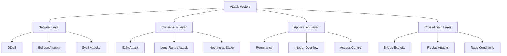
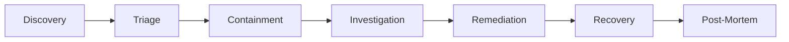

# Security Guidelines for LIP Development

This document outlines security best practices, vulnerability handling, and security considerations for LIP authors, implementers, and reviewers.

## Table of Contents

1. [Security First Principles](#security-first-principles)
2. [Threat Model](#threat-model)
3. [Security Review Process](#security-review-process)
4. [Common Vulnerabilities](#common-vulnerabilities)
5. [Smart Contract Security](#smart-contract-security)
6. [Protocol Security](#protocol-security)
7. [Cryptographic Standards](#cryptographic-standards)
8. [Incident Response](#incident-response)
9. [Security Checklist](#security-checklist)
10. [Bug Bounty Program](#bug-bounty-program)

## Security First Principles

### Defense in Depth
Multiple layers of security controls to protect against failures:
```
Layer 1: Protocol Design
Layer 2: Implementation Security
Layer 3: Operational Security
Layer 4: Monitoring & Response
Layer 5: Recovery Mechanisms
```

### Principle of Least Privilege
- Grant minimum necessary permissions
- Time-bound access where possible
- Regular permission audits
- Role-based access control

### Zero Trust Architecture
- Verify all interactions
- Assume breach scenarios
- Continuous validation
- Minimize trust boundaries

## Threat Model

### Adversary Types

#### External Attackers
- **Capabilities**: Public blockchain access, computational resources
- **Goals**: Theft, disruption, data manipulation
- **Mitigations**: Cryptographic security, rate limiting, validation

#### Malicious Validators
- **Capabilities**: Block production, network participation
- **Goals**: Censorship, double-spending, chain manipulation
- **Mitigations**: Slashing conditions, economic penalties, decentralization

#### Compromised Smart Contracts
- **Capabilities**: On-chain execution, user interactions
- **Goals**: Fund drainage, state corruption
- **Mitigations**: Audits, formal verification, upgrade mechanisms

#### Quantum Adversaries (Future)
- **Capabilities**: Quantum computing resources
- **Goals**: Break cryptographic primitives
- **Mitigations**: Quantum-resistant algorithms, migration plans

### Attack Vectors



## Security Review Process

### Pre-Implementation Review

1. **Threat Modeling Session**
   ```
   Participants: Author, Security Expert, Protocol Developer
   Duration: 2-4 hours
   Output: Threat model document
   ```

2. **Security Design Review**
   - Attack surface analysis
   - Trust boundary identification
   - Security control mapping
   - Risk assessment matrix

3. **Cryptographic Review**
   - Algorithm selection
   - Parameter choices
   - Implementation approach
   - Side-channel considerations

### Implementation Review

#### Code Review Checklist
```markdown
## General Security
- [ ] Input validation on all external data
- [ ] Proper error handling without information leakage
- [ ] No hardcoded secrets or keys
- [ ] Secure random number generation
- [ ] Protection against timing attacks

## Access Control
- [ ] Authentication mechanisms
- [ ] Authorization checks
- [ ] Permission boundaries
- [ ] Admin function protection

## State Management
- [ ] Race condition prevention
- [ ] Atomic operations
- [ ] Consistent state transitions
- [ ] Rollback mechanisms

## External Interactions
- [ ] Sanitized external calls
- [ ] Gas limit considerations
- [ ] Reentrancy protection
- [ ] Oracle manipulation prevention
```

### Post-Implementation Review

1. **Security Audit Requirements**

   | LIP Type | Audit Level | Auditor Requirements |
   |----------|-------------|---------------------|
   | Core Protocol | Full formal | 2+ independent firms |
   | Financial LRCs | Comprehensive | Specialized DeFi auditor |
   | Utility LRCs | Standard | Certified auditor |
   | Non-critical | Basic | Peer review + tools |

2. **Penetration Testing**
   - Black box testing
   - White box testing
   - Gray box testing
   - Continuous testing

3. **Formal Verification** (where applicable)
   - Mathematical proofs
   - Model checking
   - Symbolic execution
   - Property verification

## Common Vulnerabilities

### Smart Contract Vulnerabilities

#### 1. Reentrancy
```solidity
// Vulnerable
function withdraw(uint amount) external {
    require(balances[msg.sender] >= amount);
    (bool success, ) = msg.sender.call{value: amount}("");
    require(success);
    balances[msg.sender] -= amount; // State change after call
}

// Secure
function withdraw(uint amount) external {
    require(balances[msg.sender] >= amount);
    balances[msg.sender] -= amount; // State change before call
    (bool success, ) = msg.sender.call{value: amount}("");
    require(success);
}
```

#### 2. Integer Overflow/Underflow
```solidity
// Vulnerable (pre-0.8.0)
function add(uint256 a, uint256 b) public pure returns (uint256) {
    return a + b; // Can overflow
}

// Secure
function add(uint256 a, uint256 b) public pure returns (uint256) {
    uint256 c = a + b;
    require(c >= a, "Overflow");
    return c;
}
```

#### 3. Access Control
```solidity
// Vulnerable
function setOwner(address newOwner) public {
    owner = newOwner; // Anyone can call
}

// Secure
function setOwner(address newOwner) public onlyOwner {
    require(newOwner != address(0), "Invalid address");
    emit OwnershipTransferred(owner, newOwner);
    owner = newOwner;
}
```

### Protocol Vulnerabilities

#### 1. Consensus Attacks
- **Long-range attacks**: Checkpointing, key evolution
- **Nothing-at-stake**: Slashing mechanisms
- **Censorship**: Multiple block producers
- **MEV exploitation**: Fair ordering protocols

#### 2. Network Attacks
- **Eclipse attacks**: Peer diversity requirements
- **DDoS**: Rate limiting, proof-of-work
- **Sybil attacks**: Stake requirements
- **Routing attacks**: Redundant paths

#### 3. Economic Attacks
- **Flash loan attacks**: Time delays, oracles
- **Sandwich attacks**: Commit-reveal schemes
- **Front-running**: Private mempools
- **Governance attacks**: Time locks, quorum

## Smart Contract Security

### Development Practices

1. **Use Established Patterns**
   ```solidity
   // OpenZeppelin standards
   import "@openzeppelin/contracts/security/ReentrancyGuard.sol";
   import "@openzeppelin/contracts/security/Pausable.sol";
   import "@openzeppelin/contracts/access/Ownable.sol";
   ```

2. **Implement Circuit Breakers**
   ```solidity
   contract EmergencyStop is Ownable {
       bool public stopped = false;
       
       modifier stopInEmergency {
           require(!stopped, "Contract is stopped");
           _;
       }
       
       function toggleContractActive() public onlyOwner {
           stopped = !stopped;
       }
   }
   ```

3. **Use Pull Over Push**
   ```solidity
   // Bad: Push pattern
   function distribute(address[] memory recipients) public {
       for(uint i = 0; i < recipients.length; i++) {
           recipients[i].transfer(amount); // Can fail
       }
   }
   
   // Good: Pull pattern
   mapping(address => uint) public withdrawals;
   
   function withdraw() public {
       uint amount = withdrawals[msg.sender];
       withdrawals[msg.sender] = 0;
       msg.sender.transfer(amount);
   }
   ```

### Testing Requirements

```javascript
describe("Security Tests", function() {
    it("Should prevent reentrancy attacks", async function() {
        // Test reentrancy protection
    });
    
    it("Should handle integer overflow", async function() {
        // Test overflow protection
    });
    
    it("Should enforce access control", async function() {
        // Test permissions
    });
    
    it("Should survive stress tests", async function() {
        // Test under load
    });
});
```

## Protocol Security

### Chain-Specific Security

#### P-Chain Security
- Validator set management
- Stake locking mechanisms
- Subnet creation controls
- Cross-subnet security

#### C-Chain Security
- EVM compatibility issues
- Custom precompile security
- Gas optimization vs security
- Upgrade mechanisms

#### X-Chain Security
- UTXO validation
- Multi-sig implementations
- Asset issuance controls
- Transfer restrictions

#### B-Chain Security
- Attestation verification
- Privacy vs compliance
- Trusted attestor management
- Revocation mechanisms

#### Z-Chain Security
- Zero-knowledge proof validation
- Privacy pool security
- Anonymity set maintenance
- Regulatory compliance

#### A-Chain Security
- Data availability proofs
- Storage provider incentives
- Retrieval guarantees
- Archival integrity

### Cross-Chain Security

```solidity
// Secure cross-chain message handling
contract CrossChainReceiver {
    mapping(bytes32 => bool) public processedMessages;
    
    function receiveMessage(
        bytes32 messageId,
        bytes memory message,
        bytes memory proof
    ) external {
        require(!processedMessages[messageId], "Already processed");
        require(verifyProof(message, proof), "Invalid proof");
        
        processedMessages[messageId] = true;
        
        // Process message
        processMessage(message);
    }
}
```

## Cryptographic Standards

### Approved Algorithms

| Purpose | Algorithm | Key Size | Notes |
|---------|-----------|----------|-------|
| Signatures | ECDSA | 256-bit | secp256k1 |
| Hashing | SHA-256 | 256-bit | SHA3 for new |
| Encryption | AES-GCM | 256-bit | Authenticated |
| KDF | PBKDF2 | - | 10k+ iterations |
| PRNG | CSPRNG | - | OS provided |

### Quantum Resistance Roadmap

1. **Phase 1** (2025): Research and testing
   - Evaluate NIST candidates
   - Prototype implementations
   - Performance benchmarks

2. **Phase 2** (2026): Hybrid approach
   - Classical + quantum-resistant
   - Gradual migration
   - Backward compatibility

3. **Phase 3** (2027+): Full migration
   - Quantum-resistant only
   - Legacy sunset
   - Complete transition

### Implementation Guidelines

```go
// Secure key generation
func GenerateKeyPair() (*PrivateKey, *PublicKey, error) {
    // Use crypto/rand for randomness
    privateKey, err := ecdsa.GenerateKey(elliptic.P256(), rand.Reader)
    if err != nil {
        return nil, nil, err
    }
    
    // Validate key
    if !isValidPrivateKey(privateKey) {
        return nil, nil, errors.New("invalid key generated")
    }
    
    publicKey := &privateKey.PublicKey
    return privateKey, publicKey, nil
}
```

## Incident Response

### Severity Levels

| Level | Description | Response Time | Example |
|-------|-------------|---------------|---------|
| Critical | Active exploitation | < 1 hour | Fund loss |
| High | Exploitable vulnerability | < 24 hours | Access control |
| Medium | Potential vulnerability | < 1 week | Logic error |
| Low | Best practice violation | < 1 month | Gas inefficiency |

### Response Process



### Communication Protocol

1. **Internal Notification**
   - Security team alert
   - Developer notification
   - Executive briefing

2. **External Communication**
   - User warnings (if needed)
   - Public disclosure timeline
   - Patch announcement

3. **Disclosure Timeline**
   - T+0: Discovery
   - T+1h: Initial assessment
   - T+24h: Patch development
   - T+72h: Deployment
   - T+30d: Public disclosure

## Security Checklist

### For LIP Authors

Pre-submission checklist:
- [ ] Threat model documented
- [ ] Attack vectors identified
- [ ] Security considerations section complete
- [ ] Cryptographic choices justified
- [ ] Implementation security addressed
- [ ] Upgrade/migration plan included

### For Implementers

Implementation checklist:
- [ ] Security design review completed
- [ ] Secure coding practices followed
- [ ] All inputs validated
- [ ] Error handling implemented
- [ ] Access controls enforced
- [ ] State transitions atomic
- [ ] External calls protected
- [ ] Gas limits considered
- [ ] Randomness secure
- [ ] Secrets properly managed

### For Auditors

Audit checklist:
- [ ] Architecture review
- [ ] Code review
- [ ] Test coverage analysis
- [ ] Vulnerability scanning
- [ ] Manual testing
- [ ] Formal verification (if applicable)
- [ ] Performance testing
- [ ] Documentation review

## Bug Bounty Program

### Scope

In scope:
- Core protocol vulnerabilities
- Smart contract vulnerabilities
- Cryptographic weaknesses
- Economic attacks
- Cross-chain vulnerabilities

Out of scope:
- UI/UX issues
- Known issues
- Test networks
- Third-party services

### Rewards

| Severity | Reward Range | Examples |
|----------|--------------|----------|
| Critical | $50k - $500k | Fund loss, chain halt |
| High | $10k - $50k | Consensus failure |
| Medium | $1k - $10k | DoS attacks |
| Low | $100 - $1k | Best practices |

### Submission Process

1. **Report via**: security@lux.network
2. **Include**:
   - Vulnerability description
   - Impact assessment
   - Proof of concept
   - Suggested fix

3. **Response time**: 24-48 hours
4. **Fix timeline**: Based on severity

## Security Resources

### Tools

1. **Static Analysis**
   - Slither
   - Mythril
   - Securify2
   - Manticore

2. **Testing**
   - Echidna (fuzzing)
   - Foundry (testing)
   - Hardhat (framework)
   - Brownie (Python)

3. **Monitoring**
   - Forta
   - OpenZeppelin Defender
   - Tenderly
   - Custom solutions

### References

- [OWASP Smart Contract Top 10](https://owasp.org/www-project-smart-contract-top-10/)
- [ConsenSys Best Practices](https://consensys.github.io/smart-contract-best-practices/)
- [Trail of Bits Guidelines](https://blog.trailofbits.com/)
- [Lux Security Blog](https://security.lux.network)

### Training

- Security workshops
- Capture the flag (CTF)
- Code review sessions
- Incident simulations

## Conclusion

Security is not a feature but a continuous process. Every LIP must consider security from conception through implementation and beyond. By following these guidelines and maintaining vigilance, we can build a secure and resilient Lux Network.

---

*For security concerns, contact: security@lux.network*  
*Last Updated: January 2025*  
*Version: 1.0*