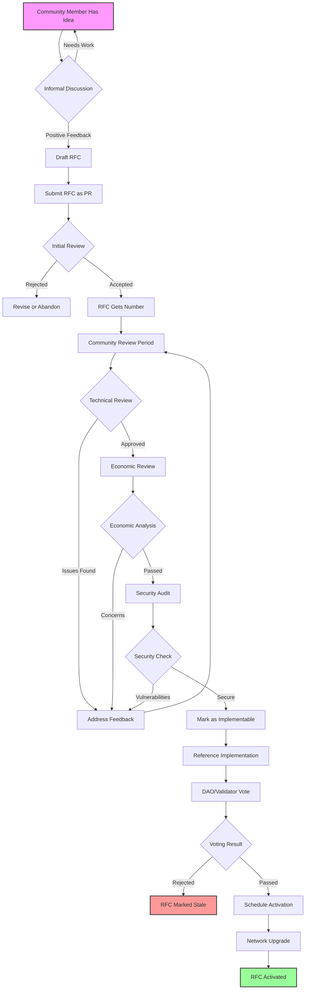

# Lux Network Standardization Flow

## Visual Overview



## Standardization Categories

### 🔧 Technical Standards (RFC-T)
```
┌─────────────────────────────────────────────────────────┐
│                   TECHNICAL STANDARDS                    │
├─────────────────────────────────────────────────────────┤
│                                                         │
│  ┌─────────────┐  ┌─────────────┐  ┌─────────────┐   │
│  │  Protocol   │  │   Network   │  │    State    │   │
│  │  Changes    │  │  Protocols  │  │ Transitions │   │
│  └─────────────┘  └─────────────┘  └─────────────┘   │
│                                                         │
│  ┌─────────────┐  ┌─────────────┐  ┌─────────────┐   │
│  │ Cryptography│  │  Consensus  │  │   Security  │   │
│  │ Primitives  │  │ Mechanisms  │  │  Features   │   │
│  └─────────────┘  └─────────────┘  └─────────────┘   │
│                                                         │
└─────────────────────────────────────────────────────────┘
```

### 📋 Interface Standards (RFC-I)
```
┌─────────────────────────────────────────────────────────┐
│                  INTERFACE STANDARDS                     │
├─────────────────────────────────────────────────────────┤
│                                                         │
│  ┌─────────────┐  ┌─────────────┐  ┌─────────────┐   │
│  │   Contract  │  │     API     │  │   Wallet    │   │
│  │ Interfaces  │  │    Specs    │  │Integration  │   │
│  └─────────────┘  └─────────────┘  └─────────────┘   │
│                                                         │
│  ┌─────────────┐  ┌─────────────┐  ┌─────────────┐   │
│  │ Cross-Chain │  │    Token    │  │   Client    │   │
│  │  Protocols  │  │  Standards  │  │ Interfaces  │   │
│  └─────────────┘  └─────────────┘  └─────────────┘   │
│                                                         │
└─────────────────────────────────────────────────────────┘
```

### 🏗️ Best Practices (RFC-B)
```
┌─────────────────────────────────────────────────────────┐
│                    BEST PRACTICES                        │
├─────────────────────────────────────────────────────────┤
│                                                         │
│  ┌─────────────┐  ┌─────────────┐  ┌─────────────┐   │
│  │    Node     │  │  Security   │  │ Development │   │
│  │ Operations  │  │  Practices  │  │  Patterns   │   │
│  └─────────────┘  └─────────────┘  └─────────────┘   │
│                                                         │
│  ┌─────────────┐  ┌─────────────┐  ┌─────────────┐   │
│  │ Monitoring  │  │   Testing   │  │ Deployment  │   │
│  │  Standards  │  │ Guidelines  │  │ Procedures  │   │
│  └─────────────┘  └─────────────┘  └─────────────┘   │
│                                                         │
└─────────────────────────────────────────────────────────┘
```

## Review Checkpoints

### 1️⃣ Technical Review Checklist
- [ ] Code compiles without errors
- [ ] All tests pass
- [ ] Backwards compatibility maintained
- [ ] Performance impact assessed
- [ ] Resource usage documented
- [ ] Edge cases handled

### 2️⃣ Economic Review Checklist
- [ ] Token economics impact analyzed
- [ ] Incentive alignment verified
- [ ] Market effects considered
- [ ] Fee structure implications
- [ ] Validator economics reviewed
- [ ] DeFi ecosystem impact assessed

### 3️⃣ Security Review Checklist
- [ ] Attack vectors identified
- [ ] Formal verification (if applicable)
- [ ] Penetration testing completed
- [ ] Dependency audit done
- [ ] Emergency response plan
- [ ] Security assumptions documented

## Decision Matrix

| RFC Type | Required Reviews | Voting Threshold | Implementation Time |
|----------|-----------------|------------------|-------------------|
| Technical Protocol | Tech + Security + Economic | 67% + Validator Majority | 3-6 months |
| Interface Standard | Tech + Community | Simple Majority | 1-3 months |
| Best Practice | Community | Simple Majority | 2-4 weeks |
| Emergency Fix | Security | Fast-track 3 signatures | 24-48 hours |
| Meta (Process) | All stakeholders | 75% Supermajority | 1-2 months |

## Standardization Timeline

```
Week 1-2:   📝 Draft Creation & Initial Feedback
Week 3-4:   🔍 Formal Review Begins
Week 5-8:   🔧 Technical & Economic Analysis
Week 9-10:  🔒 Security Audit (if required)
Week 11-12: 🗳️ Voting Period
Week 13-16: 🚀 Implementation & Testing
Week 17+:   ✅ Activation in Network Upgrade
```

## Success Metrics

### For Individual RFCs
- **Engagement**: Number of unique reviewers
- **Iteration**: Feedback incorporation rate
- **Consensus**: Final vote percentage
- **Implementation**: Time to activation
- **Adoption**: Post-activation usage

### For RFC Process
- **Throughput**: RFCs processed per quarter
- **Quality**: Post-activation issue rate
- **Participation**: Unique contributors
- **Efficiency**: Average time to decision
- **Impact**: Network improvement metrics

## Common Pitfalls to Avoid

### ❌ RFC Authors
- Incomplete problem statement
- Missing security considerations
- No backwards compatibility plan
- Ignoring community feedback
- Unrealistic implementation timeline

### ❌ Reviewers
- Bikeshedding on minor details
- Not testing reference implementation
- Ignoring economic implications
- Missing security vulnerabilities
- Delayed feedback

### ❌ Voters
- Not reading full proposal
- Voting based on author not content
- Ignoring technical feasibility
- Short-term thinking
- Low participation

## Fast-Track Scenarios

### 🚨 Emergency Security Fix
```
Discovery → Core Team Review (2hr) → Patch Development (6hr) 
    → Security Audit (4hr) → Emergency Vote (12hr) → Deploy
    
Total Time: ~24 hours
```

### 🐛 Critical Bug Fix
```
Bug Report → Reproduce & Verify (4hr) → Fix Development (8hr)
    → Testing (8hr) → Expedited Vote (24hr) → Deploy
    
Total Time: ~48 hours
```

### 📊 Parameter Adjustment
```
Analysis → Economic Review (1 week) → Community Discussion (1 week)
    → Standard Vote (1 week) → Activation
    
Total Time: ~3 weeks
```

## Integration Points

### 🔗 With Development
- CI/CD pipeline integration
- Automated testing requirements
- Code review standards
- Documentation requirements

### 🔗 With Community
- Discord RFC channel
- Weekly RFC review calls
- Forum discussion threads
- Community newsletters

### 🔗 With Validators
- Validator-specific notifications
- Upgrade coordination channels
- Testing environment access
- Performance benchmarking

## Future Enhancements

### 🔮 Planned Improvements
1. **AI-Assisted Review**: Automated first-pass analysis
2. **Simulation Framework**: Test economic impacts
3. **Formal Verification**: Mathematical proof requirements
4. **Cross-Chain Standards**: Multi-network coordination
5. **Continuous Governance**: Real-time preference tracking

This standardization flow ensures that changes to the Lux Network are thoroughly vetted, community-approved, and safely implemented while maintaining the network's security and stability.