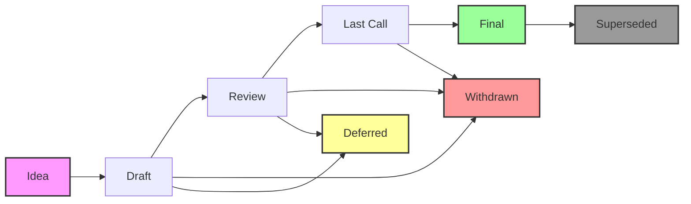

# LP Status Definitions and Lifecycle

This document defines the complete lifecycle of Lux Proposals (LPs) and explains what each status means for authors, reviewers, and implementers.

## Status Overview



## Status Definitions

### 📝 Draft
**Definition**: An LP that is open for discussion and is being actively worked on by its author(s).

**Requirements**:
- Must follow the [LP template](../LPs/TEMPLATE.md)
- Must have all required sections
- Can be incomplete but should indicate areas needing work

**Next Steps**:
- Author iterates based on community feedback
- Once ready, author requests advancement to Review

**Duration**: Unlimited (but becomes Stagnant after 6 months of inactivity)

### 🔍 Review
**Definition**: An LP that is complete and ready for formal review by the community and technical experts.

**Requirements**:
- All sections must be complete
- Reference implementation should be available (for Standards Track)
- Must address all feedback from Draft phase

**Review Types**:
- **Technical Review**: Feasibility, implementation complexity, performance impact
- **Economic Review**: Token economics, incentive alignment, market effects
- **Security Review**: Attack vectors, vulnerabilities, risk assessment

**Next Steps**:
- Address reviewer feedback
- Once reviews pass, advance to Last Call

**Duration**: 2-6 weeks depending on complexity

### ⏰ Last Call
**Definition**: The final review window before an LP becomes Final. This is the last chance for objections.

**Requirements**:
- All review feedback must be addressed
- No outstanding technical objections
- Security considerations fully documented

**Process**:
- 14-day public comment period
- Announced on all community channels
- Any critical issues restart the Review phase

**Next Steps**:
- If no blocking issues: advance to Final
- If issues found: back to Review

**Duration**: Exactly 14 days

### ✅ Final
**Definition**: An LP that has been accepted and is considered a standard. Implementation can begin or has been completed.

**Requirements**:
- Completed Last Call with no blocking issues
- For Standards Track: implementation must be possible
- For Meta/Informational: community consensus achieved

**Characteristics**:
- Only minor editorial changes allowed
- Serves as the reference specification
- May still be Superseded by future LPs

**Duration**: Permanent (unless Superseded)

### 🚫 Withdrawn
**Definition**: An LP that has been withdrawn by the author(s) and is no longer being pursued.

**Reasons**:
- Author decides not to pursue
- Fundamental flaws discovered
- Better approach identified

**Characteristics**:
- Preserved for historical reference
- Cannot be resurrected (must create new LP)
- Should document reason for withdrawal

### ⏸️ Deferred
**Definition**: An LP that is not being actively worked on but may be resumed in the future.

**Reasons**:
- Waiting for other LPs to be implemented first
- Requires technology not yet available
- Author temporarily unavailable

**Characteristics**:
- Can be reactivated by author or new champion
- Preserved in current state
- Not considered for implementation

### 🔄 Superseded
**Definition**: An LP that was Final but has been replaced by a newer LP.

**Requirements**:
- New LP must explicitly state it supersedes the old one
- Must provide migration path
- Original LP updated with supersession notice

**Characteristics**:
- Historical reference only
- Points to superseding LP
- Implementation should migrate to new standard

### 💤 Stagnant
**Definition**: An LP (usually Draft) that has been inactive for an extended period.

**Criteria**:
- No updates for 6+ months
- Author unresponsive to feedback
- Community discussion ceased

**Recovery**:
- Original author can reactivate
- New author can adopt with permission
- Otherwise moves to Withdrawn

## Status Transitions

### Allowed Transitions

| From | To | Requirements |
|------|-----|-------------|
| Idea | Draft | Create LP following template |
| Draft | Review | Author declares ready + editor approval |
| Draft | Withdrawn | Author decision |
| Draft | Deferred | Author decision with reason |
| Draft | Stagnant | 6 months inactivity |
| Review | Last Call | All reviews passed |
| Review | Draft | Major issues found |
| Review | Withdrawn | Author decision or critical flaws |
| Review | Deferred | External dependencies |
| Last Call | Final | 14 days with no blocking issues |
| Last Call | Review | Blocking issues found |
| Last Call | Withdrawn | Critical flaws discovered |
| Final | Superseded | New LP explicitly supersedes |
| Deferred | Draft | Work resumed |
| Deferred | Withdrawn | Decision not to proceed |
| Stagnant | Draft | Author returns or new champion |
| Stagnant | Withdrawn | No activity after notice |

### Transition Authority

- **Author-initiated**: Draft → Review, any → Withdrawn/Deferred
- **Editor-approved**: Review → Last Call, Last Call → Final
- **Automatic**: Draft → Stagnant (time-based)
- **Community-driven**: Stagnant → Withdrawn

## Status Requirements by LP Type

### Standards Track
- **Draft**: Technical approach outlined
- **Review**: Reference implementation + test cases
- **Last Call**: Security audit (if required)
- **Final**: Working implementation

### Meta
- **Draft**: Process clearly described
- **Review**: Community feedback incorporated
- **Last Call**: Stakeholder consensus
- **Final**: Process adopted

### Informational
- **Draft**: Information organized
- **Review**: Fact-checking complete
- **Last Call**: Community review
- **Final**: Accepted as reference

## Current LP Status Summary

For an up-to-date view of all LP statuses, refer to the [LP Index](../README.md#lp-index) in the main README.

### Status Distribution

| Status | Count | Percentage |
|--------|-------|------------|
| Draft      | 63 | 86% |
| Final      | 9  | 12% |
| Review     | 0  | 0%  |
| Last Call  | 0  | 0%  |
| Withdrawn  | 0  | 0%  |
| Deferred   | 0  | 0%  |
| Superseded | 1  | 1%  |
| Stagnant   | 0  | 0%  |

*Note: These counts are as of the last manual update. Run `make stats` for current numbers.*

## Best Practices

### For Authors
1. **Start Early**: Share ideas before drafting
2. **Engage Actively**: Respond to feedback promptly
3. **Be Specific**: Provide clear specifications
4. **Plan Ahead**: Consider implementation timeline
5. **Document Changes**: Keep changelog in LP

### For Reviewers
1. **Be Constructive**: Focus on improvements
2. **Be Timely**: Provide feedback within review periods
3. **Be Thorough**: Check all aspects (technical, economic, security)
4. **Be Clear**: State if issues are blocking or suggestions

### For Implementers
1. **Engage Early**: Participate in Draft discussions
2. **Prototype**: Build proof-of-concepts during Review
3. **Test Thoroughly**: Ensure compliance with Final spec
4. **Report Issues**: Feed back implementation experience

## Frequently Asked Questions

### Q: How long does the entire process take?
A: Typically 2-6 months from Draft to Final, depending on complexity and community engagement.

### Q: Can I update a Final LP?
A: Only minor editorial changes. Substantial changes require a new LP that supersedes the original.

### Q: What if my LP gets stuck in Review?
A: Address all feedback, engage with reviewers, and consider if the proposal needs fundamental changes.

### Q: Can someone else take over my Stagnant LP?
A: Yes, with your permission or after reasonable attempts to contact you.

### Q: Do all LPs need to reach Final status?
A: No. Some ideas work better as discussions, and it's okay to withdraw if a better approach emerges.

## Tools and Commands

```bash
# Check current status distribution
make stats

# Validate LP status field
make validate FILE=LPs/lp-20.md

# Update status (maintainers only)
# Edit the 'status:' field in the LP frontmatter
```

## References

- [GOVERNANCE.md](GOVERNANCE.md) - Full governance process
- [CONTRIBUTING.md](CONTRIBUTING.md) - How to contribute
- [LP Template](../LPs/TEMPLATE.md) - Starting template
- [GitHub Discussions](https://github.com/luxfi/lps/discussions) - Community forum
