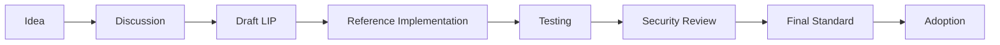

# Phase 7: Application-Level Standards (LRC Series)

## Overview

Phase 7 represents the ongoing evolution of application-level standards through the LRC (Lux Request for Comment) series. This phase focuses on creating comprehensive standards for tokens, DeFi, gaming, identity, and emerging use cases to ensure ecosystem interoperability and innovation.

## Timeline

**Start**: Q3 2026  
**Duration**: Ongoing  
**Status**: Continuous Development

## Objectives

### Primary Goals
1. Port successful Ethereum standards
2. Create Lux-specific innovations
3. Enable complex DeFi primitives
4. Support emerging use cases
5. Maintain backward compatibility

### Success Metrics
- 100+ LRC standards published
- 1000+ projects using LRCs
- 90% wallet compatibility
- Zero breaking changes
- Active developer community

## Core LRC Standards

### Token Standards

#### LIP-165: LRC-165 Interface Detection
- **Status**: Essential
- **Description**: Standard interface detection mechanism
- **Interface**:
  ```solidity
  interface ILRC165 {
    function supportsInterface(bytes4 interfaceId) external view returns (bool);
  }
  ```

#### LIP-721: LRC-721 NFT Standard
- **Status**: Final
- **Description**: Non-fungible token standard
- **Key Features**:
  - Unique token IDs
  - Ownership tracking
  - Transfer mechanisms
  - Metadata URIs
  - Event emissions

#### LIP-1155: LRC-1155 Multi-Token Standard
- **Status**: Final
- **Description**: Multi-token standard for fungible and NFTs
- **Benefits**:
  - Gas efficiency
  - Batch operations
  - Mixed token types
  - Reduced deployment costs

#### LIP-404: LRC-404 Hybrid Token Standard
- **Status**: Experimental
- **Description**: Hybrid fungible/non-fungible tokens
- **Innovation**:
  - Fractional NFT native
  - Automatic conversion
  - Liquidity pools
  - Dynamic rarity

### DeFi Standards

#### LIP-2612: LRC-2612 Permit Extension
- **Status**: Recommended
- **Description**: Gasless approvals using signatures
- **Implementation**:
  ```solidity
  function permit(
    address owner,
    address spender,
    uint256 value,
    uint256 deadline,
    uint8 v,
    bytes32 r,
    bytes32 s
  ) external;
  ```

#### LIP-4626: LRC-4626 Vault Standard
- **Status**: Final
- **Description**: Tokenized vault standard
- **Features**:
  - Standardized deposits/withdrawals
  - Share calculation
  - Yield optimization
  - Composability

#### LIP-3156: LRC-3156 Flash Loan Standard
- **Status**: Final
- **Description**: Standard flash loan interface
- **Components**:
  - Borrow function
  - Callback interface
  - Fee structure
  - Security checks

### Advanced Token Features

#### LIP-3525: LRC-3525 Semi-Fungible Token
- **Status**: Draft
- **Description**: Tokens with ID and value properties
- **Use Cases**:
  - Financial instruments
  - Game items with stats
  - Membership tiers
  - Voucher systems

#### LIP-5192: LRC-5192 Soulbound Token
- **Status**: Final
- **Description**: Non-transferable tokens
- **Applications**:
  - Credentials
  - Achievements
  - Memberships
  - Reputation

#### LIP-6551: LRC-6551 Token Bound Accounts
- **Status**: Experimental
- **Description**: NFTs as smart contract wallets
- **Features**:
  - NFT owns assets
  - Composable identity
  - On-chain history
  - Upgradeable logic

### Account Abstraction

#### LIP-4337: LRC-4337 Account Abstraction
- **Status**: In Development
- **Description**: Smart contract wallets standard
- **Components**:
  - UserOperation structure
  - Bundler interface
  - Paymaster support
  - Signature abstraction

### Gaming Standards

#### LIP-6081: LRC-6081 Game Asset Standard
- **Status**: Proposed
- **Description**: Comprehensive game asset framework
- **Features**:
  - Item attributes
  - Crafting systems
  - Level progression
  - Cross-game compatibility

#### LIP-5773: LRC-5773 Context-Dependent Multi-Asset
- **Status**: Draft
- **Description**: Assets that change based on context
- **Examples**:
  - Game items with different stats
  - Location-based NFTs
  - Time-dependent tokens
  - Conditional properties

### Social & Identity

#### LIP-735: LRC-735 Claim Holder
- **Status**: Final
- **Description**: Identity claims standard
- **Components**:
  - Claim structure
  - Verification methods
  - Revocation support
  - Privacy options

#### LIP-6239: LRC-6239 Social Recovery
- **Status**: Proposed
- **Description**: Social recovery for wallets
- **Mechanism**:
  - Guardian designation
  - Recovery threshold
  - Time delays
  - Security measures

## Implementation Framework

### Standard Development Process



### Categorization
1. **Core**: Essential standards
2. **Application**: Use-case specific
3. **Extension**: Enhances existing standards
4. **Experimental**: Cutting-edge features
5. **Deprecated**: Phased out standards

## Developer Guidelines

### Creating New Standards
1. **Research Phase**
   - Study existing standards
   - Identify gaps
   - Community feedback
   - Technical feasibility

2. **Design Phase**
   - Interface design
   - Implementation details
   - Security considerations
   - Gas optimization

3. **Implementation Phase**
   - Reference implementation
   - Test suite
   - Documentation
   - Integration examples

### Best Practices
```solidity
// Good: Clear, minimal interface
interface ILRC20 {
    function totalSupply() external view returns (uint256);
    function balanceOf(address account) external view returns (uint256);
    function transfer(address to, uint256 amount) external returns (bool);
}

// Include events for indexing
event Transfer(address indexed from, address indexed to, uint256 value);

// Use standard errors
error InsufficientBalance(uint256 available, uint256 required);
```

## Ecosystem Support

### Wallet Integration
- Standard detection via LRC-165
- Common UI/UX patterns
- Transaction formatting
- Error handling

### Tool Support
- Development frameworks
- Testing libraries
- Deployment scripts
- Verification tools

### Documentation
- Technical specifications
- Integration guides
- Security checklists
- Migration paths

## Quality Assurance

### Testing Requirements
1. **Unit Tests**: 100% coverage
2. **Integration Tests**: Cross-contract
3. **Fuzz Testing**: Edge cases
4. **Gas Testing**: Optimization
5. **Security Testing**: Vulnerabilities

### Audit Process
- Peer review required
- Security audit for financial standards
- Economic analysis for DeFi
- Performance benchmarks

## Innovation Focus Areas

### Emerging Standards
1. **AI Integration**
   - Model ownership
   - Computation tokens
   - Data marketplaces
   - Training rewards

2. **IoT Standards**
   - Device identity
   - Data streams
   - Micropayments
   - Access control

3. **Metaverse Standards**
   - Avatar portability
   - Virtual land
   - Item interoperability
   - Experience tokens

4. **DeFi 2.0**
   - Automated strategies
   - Risk tranches
   - Synthetic assets
   - Cross-chain yields

## Governance

### Standard Proposals
- Anyone can propose
- Community discussion
- Technical review
- Implementation proof
- Adoption vote

### Deprecation Process
1. Identify obsolete standard
2. Propose replacement
3. Migration period
4. Sunset timeline
5. Archive status

## Adoption Strategy

### For Projects
1. Choose appropriate standards
2. Implement correctly
3. Test thoroughly
4. Document clearly
5. Maintain compatibility

### For Ecosystem
1. Education programs
2. Implementation bounties
3. Integration support
4. Marketing assistance
5. Success showcases

## Success Stories

### Expected Achievements
- **LRC-20**: Universal token adoption
- **LRC-721**: NFT ecosystem flourishing
- **LRC-4626**: DeFi composability
- **LRC-6551**: New wallet paradigm
- **LRC-404**: Innovation in tokenomics

## Continuous Evolution

### Quarterly Reviews
- New standard proposals
- Adoption metrics
- Security incidents
- Performance data
- Community feedback

### Annual Planning
- Technology trends
- Market demands
- Regulatory changes
- Innovation priorities
- Resource allocation

## Phase Success Criteria

- [ ] 100+ LRC standards published
- [ ] 90% ecosystem adoption
- [ ] Zero critical vulnerabilities
- [ ] Active developer community
- [ ] Global recognition

## Future Vision

Phase 7 is ongoing and represents:
1. Continuous innovation
2. Ecosystem maturity
3. Developer empowerment
4. User experience excellence
5. Industry leadership

---

*This document is part of the Lux Network Standards Development Roadmap*  
*Phase 7 is an ongoing initiative that evolves with the ecosystem*